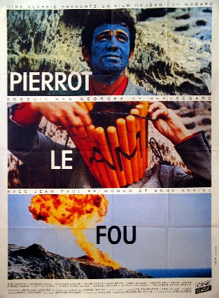

# Mes films préférés

## Nota Bene

Cette liste regroupe tous les films qui m'ont particulièrement plu, pour une raison ou pour une autre.

Pour chaque catégorie, les films sont globalement classés par ordre de préférence (les meilleurs en premier).

* 💙 = film admis comme culte, à avoir vu au moins une fois
* ❤️ = pas forcément culte mais le mériterait d'après moi, original, à voir
* 🎥 = film à l'esthétique très travaillé (🎥🎥 =  excellent cadrage en plus)

Mes sites de critiques préférés

* 🍅 https://www.rottentomatoes.com/
* 📰 http://www.telerama.fr/

Bonus: [iwdrm](https://iwdrm.tumblr.com/): des scènes cultes en gif

## Mon top 10

* Le Portrait de la Jeune Fille en Feu
* Ghost Dog
* Le Lauréat
* Blade Runner
* Eternal Sunshine
* Gattaca
* Le Nom de la Rose
* Tigre et Dragon
* Apocalypse Now
* Inglorious Basterds

## Sommaire

* [Films étrangers](#films-étrangers)
    * [Drames](#drames)
    * [Comédies](#comédies)
    * [Comédies Dramatiques](#comédies-dramatiques)
    * [Comédies Romantiques](#comédies-romantiques)
    * [Aventure/road-movie](#aventureroad-movie)
    * [Policier/Thriller](#policierthriller)
    * [Bon scénario/Twist](#bon-scénariotwist)
    * [Science-Fiction](#science-fiction)
    * [Fantastique](#fantastique)
    * [Epouvante/Horreur](#epouvante--horreur)
    * [Films de guerre](#films-de-guerre)
    * [Westerns](#westerns)
    * [Animés](#animés)
    * [Vieux classiques (noir et blanc)](#vieux-classiques-noir-et-blanc)
* [Films français](#films-français)
* [Par année de sortie](#par-année-de-sortie)
    * [2000](#2000)
    * [2010](#2010)
    * [2020](#2020)

## Films étrangers

### Drames

* Le Lauréat (1967, Mike Nichols) 🎥🎥 💙
  [🍅](https://www.rottentomatoes.com/m/graduate)
  [📰](https://www.telerama.fr/cinema/films/le-laureat,28082.php)
* Shame (2011, Steve McQueen, avec Michael Fassbender) 🎥 🎥
  [🍅](https://www.rottentomatoes.com/m/shame_2011)
* The Bridges of Madison County (1995, Clint Eastwood)
* 21 Grammes [📰](https://www.telerama.fr/cinema/films/21-grammes,151627.php)
 (Innarritu, avec Sean Penn, Naomi Watts, Benicio del Toro)
* Babel (Inarritu)
* Mar Adentro (Alejandro Amenabar, avec Javier Bardem [📰](https://www.telerama.fr/cinema/films/mar-adentro-mourir-pour-vivre,205498.php)
* Terence Malick
    * Badlands (1973, Martin Sheen)
    * The New World (2005, Christian Bale, Colin Farell)
* Tetro (FF Coppola) 🎥 [🍅](https://www.rottentomatoes.com/m/tetro)
* Les Liaisons Dangereuses (avec John Malkovich) 🎥 [🍅](https://www.rottentomatoes.com/m/1005199-dangerous_liaisons)
* Roméo et Juliette (1968, Zeffirelli) [🍅](https://www.rottentomatoes.com/m/1017834-romeo_and_juliet)
* Deep End (1970) 🎥 🎥 ❤️  [🍅](https://www.rottentomatoes.com/m/10008466-deep_end)
* Two Lovers (avec Joaquin Phoenix) 🎥
  [📰](https://www.telerama.fr/cinema/films/two-lovers,358856.php) 
  [🍅](https://www.rottentomatoes.com/m/two_lovers) 
* Bright Star 🎥 
* Taxi Driver  💙 [🍅](https://www.rottentomatoes.com/m/taxi_driver)
 (et autres de Martin Scorsese (surtout Les Affranchis))
* The Constant Gardener (avec Ralph Fiennes)
* Aguirre, la Colère de Dieu ❤️ [🍅](https://www.rottentomatoes.com/m/aguirre_the_wrath_of_god)
 (1972, Werner Herzog, avec Klaus Kinski)
* Mulholland Drive (David Lynch) [🍅](https://www.rottentomatoes.com/m/mulholland_dr)
* Kramer contre Kramer
  [🍅](https://www.rottentomatoes.com/m/kramer_vs_kramer)
  [📰](https://www.telerama.fr/cinema/films/kramer-contre-kramer,6814.php)
(avec Dustin Hoffman, Meryl Streep)
* An Education (2009, Carey Mulligan)
* Paranoid Park
* Laurence d'Arabie (1962, David Lean, avec Peter O'Toole) [🍅](https://www.rottentomatoes.com/m/lawrence_of_arabia)
* Dogville  (2003, Lars Von Trier, avec Nicole Kidman) --> mise en scène originale [🍅](https://www.rottentomatoes.com/m/dogville)
* This is England 
* The Queen (Stephen Frears) 🎥 [🍅](https://www.rottentomatoes.com/m/queen)
* Le Dernier Roi d'Ecosse (2006, avec Forest Whitaker) [🍅](https://www.rottentomatoes.com/m/last_king_of_scotland)
* Sex, Lies and Videotape (1989, Steven Soderbergh) [🍅](https://www.rottentomatoes.com/m/sex_lies_and_videotape)
* Minuit dans le Jardin du Bien et du Mal (Clint Eastwood) --> esthétique bof mais scénario+
* Drames bien genre on s'en souvient après, mais qui traînent un peu en longueur:
    * Disgrace (2008, avec John Malkovich) [🍅](https://www.rottentomatoes.com/m/disgrace/)
    * La Porte du Paradis (1980) (Michael Cimino) [📰](https://www.telerama.fr/cinema/films/la-porte-du-paradis,481506.php)

### Comédies

* Midnight in Paris (et autres de Woody Allen) 🎥
* The Darjeeling Limited
* Lost in Translation  (2003, Sofia Coppola) 🎥 [🍅](https://www.rottentomatoes.com/m/lost_in_translation)
* Juno  [🍅](https://www.rottentomatoes.com/m/juno)
* The Big Lebowski   (et autres des frères Coen) 💙 [🍅](https://www.rottentomatoes.com/m/big_lebowski)
* Clerks, les employés modèles  (1994) 💙 [🍅](https://www.rottentomatoes.com/m/clerks)
* Kiss Kiss Bang Bang  [🍅](https://www.rottentomatoes.com/m/kiss_kiss_bang_bang)
* Thank You for Smoking (avec Aaron Eckhart)
* Kaboom  (2010, Greg Araki) [📰](https://television.telerama.fr/tele/films/kaboom,19234405.php)
* Vampires en toute Intimité (What we do in the Shadows)
* Shaun of the Dead
* Zombieland  (2009) [🍅](https://www.rottentomatoes.com/m/zombieland)
* Tootsie  (1982) --> pour Dustin Hoffman [(et voir ici)](http://www.rue89.com/rue89-culture/zapnet/2013/07/10/dustin-hoffman-crois-suis-femme-interessante-244106) [🍅](https://www.rottentomatoes.com/m/tootsie)
Le Tigre et la Neige (Roberto Benigni)

### Comédies dramatiques

* Volver  (2006) (et autres de Pedro Almodovar) 🎥 [🍅](https://www.rottentomatoes.com/m/volver)
* Les Ailes du Désir  (1987, Wim Wenders) [🍅](https://www.rottentomatoes.com/m/wings_of_desire)
* Thelma et Louise  (1991, Ridley Scott) [🍅](https://www.rottentomatoes.com/m/thelma_and_louise)

### Comédies romantiques

* Ted  (2012) [🍅](https://www.rottentomatoes.com/m/ted_2012)

### Parodique/second degré

* Sugarland Express (1974, Steven Spielberg) ❤️
* Machete  (2010, Robert Rodriguez) ❤️ [🍅](https://www.rottentomatoes.com/m/machete)
* Perdita Durango   (1997, avec Javier Bardem) [📰](https://www.telerama.fr/cinema/films/perdita-durango,45065.php)
* From Dusk till Dawn (1996, Robert Rodriguez, avec Harvey Keitel)

### Aventure/road-movie

* Tigre et Dragon  (2000, Ang Lee) 🎥 [🍅](https://www.rottentomatoes.com/m/crouching_tiger_hidden_dragon)
* Into The Wild  (2007, Sean Penn) [🍅](https://www.rottentomatoes.com/m/into_the_wild)

### Policier/Thriller

* Ghost Dog
  [🍅](https://www.rottentomatoes.com/m/ghost_dog_the_way_of_the_samurai)
  [📰](http://www.telerama.fr/cinema/films/ghost-dog-la-voie-du-samourai,46863.php)
(1999, avec Forest Whitaker) (et autres de Jim Jarmusch)
* Le Nom de la Rose  [🍅](https://www.rottentomatoes.com/m/the_name_of_the_rose_1986)
(JJ Annaud, avec Sean Connery, Michael Lonsdale...)
* Les Trois Jours du Condor  [🍅](https://www.rottentomatoes.com/m/three_days_of_the_condor)
(Sydney Pollack, avec Robert Redford)
* Marathon Man    (avec Dustin Hoffman, Michael Caine) [🍅](https://www.rottentomatoes.com/m/marathon_man)
The Girl with the Dragon Tattoo (David Fincher)
Zodiac (David Fincher)
* L.A. Confidential  (avec Kevin Spacey) [🍅](https://www.rottentomatoes.com/m/la_confidential)
* Mystic River  (2003, Clint Eastwood, avec Sean Penn) [🍅](https://www.rottentomatoes.com/m/mystic_river)
Collateral (Michael Mann)
* L'Affaire Thomas Crown  (l'original de 1968 , avec Steve McQueen, Faye Dunaway) 🎥 [🍅](https://www.rottentomatoes.com/m/thomas_crown_affair)
* Insomnia  (Christopher Nolan, avec Al Pacino) [🍅](https://www.rottentomatoes.com/m/1114154-insomnia)
* Cosmopolis  (et autres de David Cronemberg) [📰](https://www.telerama.fr/cinema/films/cosmopolis,434015.php)
* The Pledge (Sean Penn, avec Jack Nicholson)
* King of New York  (1990) (le meilleur rôle de Christopher Walken) 🎥 [🍅](https://www.rottentomatoes.com/m/king_of_new_york)
* Aniki mon Frère (et autres de Takeshi Kitano)
* Witness  (Peter Weier, avec Harrison Ford) [🍅](https://www.rottentomatoes.com/m/1023854-witness)
* Copland  (1997, avec Ray Liotta, Harvey Keitel) [🍅](https://www.rottentomatoes.com/m/cop_land)
* Sin City  (2005) [🍅](https://www.rottentomatoes.com/m/sin_city)
* OldBoy  (2004) [🍅](https://www.rottentomatoes.com/m/oldboy)
* La Corde (Hitchcock)
* Side Effects (2013, Steven Soderbergh)

### Bon scénario/Twist

* The Truman Show
* Eternal Sunshine (et autres de Michel Gondry) 🎥
* Memento (Christopher Nolan)
* eXistenZ  [🍅](https://www.rottentomatoes.com/m/existenz)
(David Cronemberg, avec Jude Law, Jennifer Jason Leigh, Willem Dafoe)
* Inception (Christopher Nolan)
* Shutter Island (\MartinScorsese)
* Le Limier  [📰](https://www.telerama.fr/cinema/films/le-limier-sleuth,332335.php)
(le remake, à défaut)(Kenneth Branagh, avec Jude Law, Michael Caine)
* Dans la peau de John Malkovich (avec John Malkovich)
* Usual Suspects (avec Kevin Spacey)
* Duel  (Spielberg) 💙 [🍅](https://www.rottentomatoes.com/m/1006345-duel)
* The Man from Earth   (tout repose sur le scénario, très original) [🍅](https://www.rottentomatoes.com/m/man_from_earth)
* The Machinist
* Le Prestige
* Un Jour sans Fin (avec Bill Murray)

### Science-Fiction

* Brazil  (Terry Gilliam) 💙 [🍅](https://www.rottentomatoes.com/m/1003033-brazil)
* Blade Runner  (Ridley Scott, avec Harrison Ford) 🎥 💙 [🍅](https://www.rottentomatoes.com/m/blade_runner)
* Bienvenue à Gattaca   (avec Ethan Hawke, Jude Law) 💙 [🍅](https://www.rottentomatoes.com/m/gattaca)
* La Planète des Singes  (l'original, avec Charlton Heston) [🍅](https://www.rottentomatoes.com/m/1016397-planet_of_the_apes)
* District 9  (2009) [🍅](https://www.rottentomatoes.com/m/district_9)
* Soleil Vert  (1973, avec Charlton Heston) ❤️ [🍅](https://www.rottentomatoes.com/m/soylent_green)
* Moon  (2009) 🎥 [🍅](https://www.rottentomatoes.com/m/10009075-moon)
* Alien  (1979, Ridley Scott) 💙 [🍅](https://www.rottentomatoes.com/m/alien)
* Alien IV  [📰](https://www.telerama.fr/cinema/films/alien-la-r-surrection,27380.php)
(JP Jeunet)
* 2001 A Space Odyssey   (\StanleyKubrick) 💙 [🍅](https://www.rottentomatoes.com/m/1000085-2001_a_space_odyssey)
* Le Monde sur le Fil (1973, Rainer Werner Fassbinder)
* THX 1138   (1971, Georges Lucas) [🍅](https://www.rottentomatoes.com/m/thx_1138)
* Antiviral
* The Island  (2005) (voir juste la première heure, après c'est nul) [🍅](https://www.rottentomatoes.com/m/island)

### Fantastique

* Phantom of the Paradise (1974, Brian de Palma)
* La Compagnie des Loups  (1984) [🍅](https://www.rottentomatoes.com/m/company_of_wolves)
* Arizona Dream  💙 [🍅](https://www.rottentomatoes.com/m/arizona_dream)
(1993, Kusturica, avec Johnny Depp) (très bonne musique)
* Edward aux mains d'argent
* [The Fall](http://www.imdb.com/title/tt0460791) (2006)

#### Vampires

* Le Bal des Vampires  (1967, \RomanPolanski) (parodique) 🎥 [🍅](https://www.rottentomatoes.com/m/the_fearless_vampire_killers)
* Nosferatu  (1922, Murnau) [🍅](https://www.rottentomatoes.com/m/nosferatu)
* Entretien avec un Vampire  (1994) [🍅](https://www.rottentomatoes.com/m/interview_with_the_vampire)

### Epouvante / Horreur

* Rosemary's Baby (Roman Polanski) 🎥 💙
  [🍅](https://www.rottentomatoes.com/m/rosemarys_baby)
  [(qq explications ici)](http://rustyjames.canalblog.com/archives/2012/01/18/23280749.html)
* Le Silence des Agneaux  (1991, avec Anthony Hopkins) 💙 [🍅](https://www.rottentomatoes.com/m/silence_of_the_lambs)
* Elephant Man  (1980, avec Anthony Hopkins) 🎥 💙 [🍅](https://www.rottentomatoes.com/m/1006527-elephant_man)
* Délivrance  (1972) ❤️ [🍅](https://www.rottentomatoes.com/m/deliverance)
* Shining  (1980, \StanleyKubrick) [🍅](https://www.rottentomatoes.com/m/shining)
* The Others (Amenabar)
* Psychose (Hitchcock) 💙
* Scream (que le premier)
* L'Orphelinat
* Ringu  (1998, film japonais qui a inspiré The Ring) [🍅](https://www.rottentomatoes.com/m/ringu)
* Morse  -> très beau mais le scénario est un peu mou 🎥 [📰](https://www.telerama.fr/cinema/films/morse,365114.php)
* Impetigore (2019)

### Films de Guerre

* Apocalypse Now  (Coppola) 🎥 💙 [🍅](https://www.rottentomatoes.com/m/apocalypse_now)
* Full Metal Jacket   (Stanley Kubrick) 💙 [🍅](https://www.rottentomatoes.com/m/full_metal_jacket)
* Voyage au Bout de l'Enfer   (avec de Niro, Christopher Walken) [🍅](https://www.rottentomatoes.com/m/deer_hunter)
* Inglorious Basterds  (et autres de Tarentino) 🎥 [🍅](https://www.rottentomatoes.com/m/inglourious_basterds)

### Westerns

#### Sérieux

* Danse avec les Loups  [🍅](https://www.rottentomatoes.com/m/dances_with_wolves)
(de et avec Kevin Costner, Oscar meilleur film 1991) 🎥
* There Will Be Blood   (2007, P.T. Anderson, avec Daniel Day Lewis)  --> à voir 🎥 [🍅](https://www.rottentomatoes.com/m/there_will_be_blood)

#### Spaghettis (parodique)

* La Trilogie du Dollar (Sergio Leone, avec Clint Eastwood): 🎥 💙

	* Pour une poignée de dollars  (1964) [🍅](https://www.rottentomatoes.com/m/fistful_of_dollars)
	* Et pour quelques Dollars de plus  (1965) [🍅](https://www.rottentomatoes.com/m/for_a_few_dollars_more)
	* Le Bon, la Brute et le Truand  (1966) [🍅](https://www.rottentomatoes.com/m/good_the_bad_and_the_ugly)

* L'Homme des Hautes Plaines   (de et avec Clint Eastwood) 🎥 [🍅](https://www.rottentomatoes.com/m/high_plains_drifter)
* Impitoyable  [🍅](https://www.rottentomatoes.com/m/1041911-unforgiven)
(de et avec Clint Eastwood, Oscar meilleur film 1992)

#### Néowesterns

* Trois Enterrements  [🍅](https://www.rottentomatoes.com/m/three_burials_of_melquiades_estrada)
(de et avec Tommy Lee Jones)
* Lone Star  [🍅](https://www.rottentomatoes.com/m/1074022-lone_star)

### Aventure et divertissement familial

* [Indiana Jones 1, 2 et 3](https://www.rottentomatoes.com/search/?search=indiana+jones&sitesearch=rt)
(Spielberg)
* [Pirates des Caraïbes 1, 2 et 3](https://www.rottentomatoes.com/search/?search=pirates+of+the+caribbean&sitesearch=rt)
* Be Kind, Rewind (Michel Gondry)

### Animés

* La plupart des Miyasaki
    * Princesse Mononoke
    * Nausicaa de la Vallée du Vent
    * Le Chateau dans le Ciel
    * ...
* Ghost in the Shell (le film, pas la série), le 2e film aussi

### Vieux classiques (noir et blanc)

* La Vie est Belle  (Capra, 1946) [🍅](https://www.rottentomatoes.com/m/1010792-its_a_wonderful_life)
* Casablanca  (Michael Curtiz, 1942) [🍅](https://www.rottentomatoes.com/m/1003707-casablanca)
* Citizen Kane   (\OrsonWelles, 1941) 🎥 [🍅](https://www.rottentomatoes.com/m/citizen_kane)
* The Lady from Shanghai  (\OrsonWelles, 1948) [🍅](https://www.rottentomatoes.com/m/lady_from_shanghai)
* 12 Hommes en Colère  (Sidney Lumet, 1957) [🍅](https://www.rottentomatoes.com/m/1000013-12_angry_men)
* Certains l'aiment Chaud  (Billy Wilder, 1957) [🍅](https://www.rottentomatoes.com/m/some_like_it_hot)
* Rashomon   (Akira Kurosawa, 1951) [🍅](https://www.rottentomatoes.com/m/rashomon)
* Les 7 Samourais   (Akira Kurosawa, 1954) [🍅](https://www.rottentomatoes.com/m/1018639-seven_samurai)
* Un Chien Andalou (Luis Bunuel)(à voir pour sa culture ciné)

## Films français
### Comédies

* Ridicule (1996, Patrice Lecomte, Jean Rochefort)
* Le Nom des Gens  [📰](https://television.telerama.fr/tele/films/le-nom-des-gens,17204080.php)
(2010, avec Jacques Gamblin)
* Le Bruit des Glaçons  [📰](https://www.telerama.fr/cinema/films/le-bruit-des-gla-ons,414024.php)
(2010, Bertrand Blier, avec Jean Dujardin, Albert Dupontel)
* Intouchables (2011) [📰](https://television.telerama.fr/tele/films/intouchables,29464803.php)
(2011, avec François Cluzet)
* The Artist  [📰](https://www.telerama.fr/cinema/films/the-artist,428139.php)
(2011, Michel Hazanavicius, avec Jean Dujardin)
L'Arnacoeur (Romain Duris)
* Un Singe en Hiver  (1962, avec Jean-Paul Belmondo, Jean Gabin)  -> dialogues excellents (Audiard), musique très sympa [📰](https://www.telerama.fr/cinema/films/un-singe-en-hiver,42689.php)
* Fais Moi Plaisir (2009) [📰](https://www.telerama.fr/cinema/films/fais-moi-plaisir,382359.php)
* Rire et Châtiment  [📰](https://television.telerama.fr/tele/films/rire-et-chatiment,1701812.php)
(2003, avec José Garcia)
* Le Diner de Cons  [📰](https://www.telerama.fr/cinema/films/le-diner-de-cons,43753.php)
(1997, avec Jacques Villeret)
Le Concert (2009, Radu Mihaileanu)
* avec Michel Houellebecq:
    * L'enlèvement de Michel Houellebecq
    * Near Death Experience

### Comédies dramatiques

* Amélie Poulain   (2000, JP Jeunet) [📰](https://www.telerama.fr/cinema/films/le-fabuleux-destin-d-am-lie-poulain,54074.php)
* L'Auberge Espagnole  (2002, Cédric Klapisch) [📰](https://www.telerama.fr/cinema/films/l-auberge-espagnole,60443.php)
* Mon Oncle d'Amérique  (1980, Alain Resnais, avec Depardieu) [📰](https://www.telerama.fr/cinema/films/mon-oncle-d-amerique,8936.php)
Tournée (Mathieu Amalric) 🎥
* Mammuth  (2010, Délépine et Kervern, avec Gérard Depardieu) [📰](https://www.telerama.fr/cinema/films/mammuth,405676.php)
* Louise-Michel  (2007, Délépine et Kervern) [📰](https://www.telerama.fr/cinema/films/louise-michel,359692.php)
* Habemus Papam (2011, Nanni Moretti)
* le grand soir

### Drames

* Pierrot le Fou  (1965, Godard) 🎥 🎥 [📰](https://www.telerama.fr/cinema/films/pierrot-le-fou-version-restauree,4609.php)
* Le Mépris  [📰](https://www.telerama.fr/cinema/films/le-mepris,4799.php)
(1963, Godard) 🎥 🎥
* La Haine
* Des Hommes et des Dieux  [📰](https://www.telerama.fr/cinema/films/des-hommes-et-des-dieux,196039.php)
(2010, avec Michael Lonsdale) 🎥
* La Journée de la Jupe  [📰](https://www.telerama.fr/cinema/films/la-journee-de-la-jupe,374390.php)
(2008)
* Tous les Matins du Monde  [📰](https://www.telerama.fr/cinema/films/tous-les-matins-du-monde,8360.php)
(1991, avec Gérard Depardieu)
* Le Chat  (1971) (avec Jean Gabin, Simone Signoret) [📰](https://www.telerama.fr/cinema/films/le-chat,15925.php)
* Les Grandes Personnes  (2008, avec JP Darroussin) [📰](https://www.telerama.fr/cinema/films/les-grandes-personnes,347066.php)
* Polisse  [📰](https://television.telerama.fr/tele/films/polisse,27602990.php)
(2011)
* Claude Sautet
    * César et Rosalie
    * Max et les Ferrailleurs
* Xavier Dolan
    * Laurence Anyways
    * Tom à la Ferme
    * Les Amours Imaginaires

### Policier

* Le Samouraï  [📰](https://www.telerama.fr/cinema/films/le-samoura,16660.php)
(1967) (et autres de Jean-Pierre Melville) 🎥 🎥
* Garde à Vue  [📰](https://television.telerama.fr/tele/films/garde-a-vue,27596.php)
(1981, Claude Miller, avec Michel Serrault, Gérard Depardieu)

### SF

* Alphaville (1965, Jean-Luc Godard)

### Films à sketches

* Astérix et Obélix Mission Cléopâtre
* 2h moins le quart avant Jésus-Christ (Coluche)

### Autres

* Le Crabe-Tambour  [📰](https://www.telerama.fr/cinema/films/le-crabe-tambour,47984.php)
(1977, Pierre Schoenderffer)
* Les Derniers Jours du Monde  [📰](https://television.telerama.fr/tele/films/les-derniers-jours-du-monde,13356921.php)
(2009, SF, avec Mathieu Amalric)

### Vieux classiques (noir et blanc)

* Les Tontons Flingueurs  [📰](https://www.telerama.fr/cinema/films/les-tontons-flingueurs,14855.php)
(1963, Lautner, Audiard, avec Lino Ventura)
* Le Soupirant  (1962, Pierre Etaix) 🎥 [📰](https://www.telerama.fr/cinema/films/le-soupirant-en-version-restauree,14179.php)
* Lola  [📰](https://www.telerama.fr/cinema/films/lola,9759.php)
(1961) (et autres de Jacques Demy) 🎥

## En vrac, pas triés

* midnight express
* le maitre du jeu
* leaving las vegas
* killing them softly
* battle royale
* le cercle des poètes disparus
* inherent vice
* thrillers policiers + romance
    * body heat
    * Sea of Love
* etat second
* smoke
* entre ses syeux
* le locataire
* ne vous retournez pas (suspense et musiques +)
* 2 days in paris
* le grand silence
* le pacte des loups
* a royal affair
* soleil trompeur
* Oubli: rajouter eternal sunshine en 3eme dans les drames de ma liste de films
* gone baby gone
* good will hunting
* the place beyond the pines 
* une nuit à new york
* buffet froid
* truman capote
* l'homme qui voulut être roi
* Suspiria, pour le cadrage et l'esthétique
* soleil trompeur
* rubber
* jimmy riviere
* une séparation
* ne le dis à personne
* le limier, l'original
* la fausse suivante
* okuribito (Départs)
* La Vérité, HG clouzot
* the grandmaster
* il était une fois en anatolie
* whiplash
* winter sleep
* solaris
* Comedy: 
    * starbuck
    * the 40 year old virgin
    * hapiness therapy
    * do the right thing
* WWII
    * Le Pianiste
    * la liste de schindler
    * la vie est belle
* Zhang Yimou (Hero, ...)
* les combattants

## Autres

### Séries

* Dexter
* Docteur House (surtout la saison 4)
* How I met your Mother
* The Big Bang Theory
* Scrubs

## Par année de sortie

### 2000

* In the Mood for Love (Wong Kar-wai)
* American Beauty (Sam Mendes)
* Billy Elliot
* Dancer in the Dark (Lars von Trier)

[Césars 27](https://fr.wikipedia.org/wiki/26e_c%C3%A9r%C3%A9monie_des_C%C3%A9sar#C%C3%A9sar_du_meilleur_film)

* Harry, un ami qui vous veut du bien
* Les Rivières pourpres

### 2001

* Mulholland Drive (David Lynch)

[Césars 27](https://fr.wikipedia.org/wiki/27e_c%C3%A9r%C3%A9monie_des_C%C3%A9sar#C%C3%A9sar_du_meilleur_film)

* Le Fabuleux Destin d'Amélie Poulain
* Tanguy
* Le Peuple migrateur (docu)

### 2002

* Le Voyage de Chihiro

[Césars 28](https://fr.wikipedia.org/wiki/28e_c%C3%A9r%C3%A9monie_des_C%C3%A9sar#C%C3%A9sar_du_meilleur_film)

* Le Pianiste
* Astérix et Obélix : Mission Cléopâtre
* L'Auberge espagnole
* Être et avoir
* Monsieur Batignole

### 2003

* Good Bye, Lenin! (Wolfgang Becker, Allemagne)

[Césars 29](https://fr.wikipedia.org/wiki/29e_c%C3%A9r%C3%A9monie_des_C%C3%A9sar#C%C3%A9sar_du_meilleur_film)

* Les Triplettes de Belleville

### 2004

* Lost in Translation (Sofia Coppola)
* Eternal Sunshine of the Spotless Mind (Michel Gondry)
* Kill Bill
* 21 Grammes (Alejandro Gonzalez Inarritu)
* La Mauvaise Éducation (Pedro Almodóvar)
* Mystic River (Clint Eastwood)

[Césars 30](https://fr.wikipedia.org/wiki/30e_c%C3%A9r%C3%A9monie_des_C%C3%A9sar#C%C3%A9sar_du_meilleur_film)

* Les Choristes
* Violence des échanges en milieu tempéré

### 2005

* A History of Violence (David Cronenberg)
* Mar adentro (Alejandro Amenábar)
* Million Dollar Baby

[Césars 31](https://fr.wikipedia.org/wiki/31e_c%C3%A9r%C3%A9monie_des_C%C3%A9sar#Meilleur_film)

* Va, vis et deviens

### 2006

* Little Miss Sunshine
* Volver (Pedro Almodóvar)
* Le Secret de Brokeback Mountain (Ang Lee)
* Babel (Alejandro González Iñárritu)
* The Queen (Stephen Frears)

[Césars 32](https://fr.wikipedia.org/wiki/32e_c%C3%A9r%C3%A9monie_des_C%C3%A9sar#Meilleur_film_fran%C3%A7ais)

* Indigènes
* OSS 117
* Quatre étoiles (comédie, Carré/Garcia)

### 2007

* No Country for Old Men

[Césars 33](https://fr.wikipedia.org/wiki/33e_c%C3%A9r%C3%A9monie_des_C%C3%A9sar#Meilleur_film_fran%C3%A7ais)

* Persépolis
* à voir: https://www.telerama.fr/cinema/films/le-scaphandre-et-le-papillon,302739.php

### 2008

* Burn After Reading
* Zetwal

[Césars 34](https://fr.wikipedia.org/wiki/34e_c%C3%A9r%C3%A9monie_des_C%C3%A9sar)

* Entre les murs
* Le Crime est notre affaire
* Bienvenue chez les Ch'tis

### 2009

[Césars 35](https://fr.wikipedia.org/wiki/35e_c%C3%A9r%C3%A9monie_des_C%C3%A9sar#Meilleur_film)

* La Journée de la jupe
* à voir: Welcome
* à voir: https://www.telerama.fr/cinema/films/les-herbes-folles,391302.php

### 2010

* True Grit

[Césars 36](https://fr.wikipedia.org/wiki/36e_c%C3%A9r%C3%A9monie_des_C%C3%A9sar#Meilleur_film)

* Le Bruit des glaçons
* Le Noms des Gens
* Des hommes et des dieux
* L'Arnacoeur
* Tournée
* Mammouth
* La Princesse de Montpensier (à voir ?)

### 2011

* Midnight in Paris (Woody Allen)
* Drive
* Millenium
* Starbuck
* Le Moine
* Tinker Tailor Soldier Spy (La Taupe)

[Césars 37](https://fr.wikipedia.org/wiki/37e_c%C3%A9r%C3%A9monie_des_C%C3%A9sar#Meilleur_film)

* The Artist
* Intouchables (Sy, Cluzet)
* Polisse
* à voir:
    * Le Havre (Aki Kaurismäki)
    * La guerre est déclarée (V. Donzelli)

### 2012

* Beasts of the Southern Wild
* Mud

[Césars 38](https://fr.wikipedia.org/wiki/38e_c%C3%A9r%C3%A9monie_des_C%C3%A9sar#Meilleur_film)

* Holy Motors (Leos Carax)
* Amour (Michael Haneke)

### 2013

* Under the Skin
* All is Lost (?)

[Césars 39](https://fr.wikipedia.org/wiki/39e_c%C3%A9r%C3%A9monie_des_C%C3%A9sar#Meilleur_film)

### 2014

* Nightcrawler
* Ex Machina
* Whiplash
* Hippocrate
* Birdman
* Gone Girl (Fincher)
* Nos étoiles contraires (?)
* watchlist: Selma

[Césars 40](https://fr.wikipedia.org/wiki/40e_c%C3%A9r%C3%A9monie_des_C%C3%A9sar#Meilleur_film)

* Les Combattants
* Hippocrate

### 2015

* Mustang (Turquie)
* The Assassin 🎥 (arts martiaux chinois)
* The Lobster

[Césars 41](https://fr.wikipedia.org/wiki/41e_c%C3%A9r%C3%A9monie_des_C%C3%A9sar#Meilleur_film)

* Mustang
* aimé, pas inoubliable:
    * La Loi du Marché

### 2016

* Lion
* Love and Friendship
* La La Land
* I Daniel Blake
* Toni Erdmann
* Hacksaw Ridge
* Manchester by the Sea (?)

[Césars 42](https://fr.wikipedia.org/wiki/42e_c%C3%A9r%C3%A9monie_des_C%C3%A9sar#Meilleur_film)

* à voir: Dans les forêts de Sibérie (musique par Ibrahim Maalouf)

### 2017

* Wind River

[Césars 43](https://fr.wikipedia.org/wiki/43e_c%C3%A9r%C3%A9monie_des_C%C3%A9sar#Meilleur_film)

* 120 battements par minute
* Le Brio (bon, pas inoubliable)

### 2018

* Dunkirk
* Three Billboards
* L'Empereur de Paris (Vincent Cassel)
* La Saveur des Ramens
* La Ballade de Buster Scruggs

[Césars 44](https://fr.wikipedia.org/wiki/44e_c%C3%A9r%C3%A9monie_des_C%C3%A9sar#Meilleur_film)

* L'Empereur de Paris (Vincent Cassel)
* à voir: En liberté !
* Mademoiselle de Joncquières (comédie dramatique romantique, sympa mais pas inoubliable)

### 2019

* 1917 🎥
* Joker
* Jojo Rabbit
* Marriage Story
* Le Roi (Chalamet, Netflix)
* Scheme Birds (documentaire)
* The Two Popes

[Césars 45](https://fr.wikipedia.org/wiki/45e_c%C3%A9r%C3%A9monie_des_C%C3%A9sar#Meilleur_film)

* Le Portrait de la Jeune Fille en Feu (Céline Sciamma) 🎥🎥
* Proxima (Eva Green)
* J'accuse (Polanski)

Décevant:

* Parasite
* Once Upon a Time in Hollywood
* Les Misérables

### 2020

* La plataforma (Netflix, SF)
* L'Homme Invisible (avec Elisabeth Moss)
* Drunk (Mads Mikkelsen)

Aimés sans plus:

* Sound of Metal
* Soul (Pixar)

[Césars 46](https://fr.wikipedia.org/wiki/46e_c%C3%A9r%C3%A9monie_des_C%C3%A9sar#Meilleur_film)
