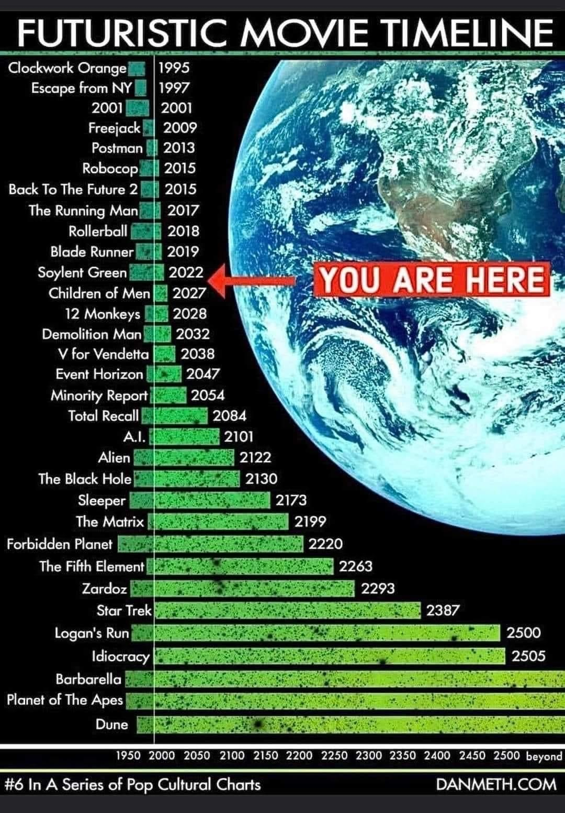
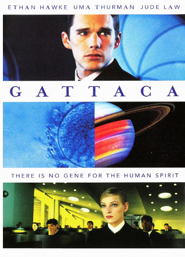
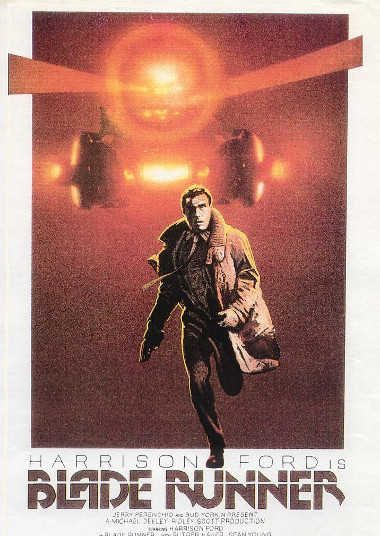
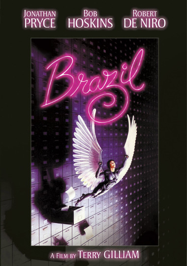

# Liste de films vus

Mon top 15 films préférés

* Portrait de la Jeune Fille en Feu
* Ghost Dog
* Blade Runner
* Gattaca
* Hateful Eight (Tarentino)
* Fight Club
* Le Lauréat
* Eternal Sunshine of the Spotless Mind
* Le Nom de la Rose
* Tigre et Dragon
* Apocalypse Now
* Lion
* Nightcrawler
* Aguirre, la Colère de Dieu
* Inglorious Basterds
* Le Sel de la Terre (docu)
* Zétwal (docu)
* Baraka (docu)
* Scheme Birds (docu)

Légende

* 💙 = film admis comme culte, à avoir vu une fois
* ❤️ = mes films préférés
* 🎥 = film à l'esthétique très travaillé
* 🍿 = divertissement léger
* 🎵 = comédie musicale / film musical
* 🏆 = nominé aux Oscars
* ✨ = nominé aux Césars
* 🌿 = nominé à Cannes
* ☀️ = nominé au Sundance Festival
* 🧸 = nominé à la Berlinale
* 🌐 = nominé aux Golden Globes
* 🎭 = nominé aux Bafta
* 🦁 = nominé à la Mostra de Venise
* 🍅 = lien vers [rottentomatoes.com](https://www.rottentomatoes.com/)
* 📰 = lien vers [telerama.fr](https://www.telerama.fr/)
* ◯ = film disponible sur [Criterion Channel](https://www.criterionchannel.com/)
* ▶️ = lien pour voir le film

Astuces

Où voir des films

* https://www.lacinetek.com/fr
* https://films.criterionchannel.com/
* https://mubi.com/fr/showing
    * https://mubi.com/fr/specials/mubi-top-1000
    * https://mubi.com/fr/lists/the-top-1000
    * https://mubi.com/fr/specials/cannes-film-festival
    * https://mubi.com/fr/specials/fortnight
    * https://mubi.com/fr/specials/film-festival-favorites
* [movieo.me](https://movieo.me/movies?years%5B%5D=1900&years%5B%5D=2021&netflix_instant=true): un site qui permet de filtrer les bons films qui sont sur Netflix (US)

Vidéos analyse

* [Quentin Tarantino and the Poetry Between the Lines](https://www.youtube.com/watch?v=-sLV-UzASMg)
* [How Tarantino Writes A Scene](https://www.youtube.com/watch?v=XATONsyKml0)

Chaînes Youtube

* [Now You See It](https://www.youtube.com/c/NowYouSeeIt/videos)
* [Every Frame a Painting](https://www.youtube.com/c/everyframeapainting/videos)
* [The Closer Look](https://www.youtube.com/c/TheCloserLook/videos)
* [Blow Up (arte)](https://www.youtube.com/@blowuplactualiteducinemaou121)
* [La chronique de Thomas Bidegain - France Inter](https://www.youtube.com/watch?v=JDaK6vHlGWk&list=PL43OynbWaTMKQkvk6IBpR6Ux74MGOYSM5&index=2)
* [Konbini video club](https://www.youtube.com/results?search_query=konbini+video+club)
* [Le Fossoyeur de Films](https://www.youtube.com/user/deadwattsofficiel/videos)
* https://www.instagram.com/cinemaaoftheworld/

Articles divers

* https://en.wikipedia.org/wiki/MacGuffin
* https://en.wikipedia.org/wiki/Chekhov%27s_gun
* https://en.wikipedia.org/wiki/Mexican_standoff
* https://www.sebmagic.com/2024/04/le-plan-signature-au-cinema-les-gimmicks-des-realisateurs.html

Sites web divers

* https://www.theyshootpictures.com/
* [iwdrm](https://iwdrm.tumblr.com/): des scènes cultes en gif
* [framed.wtf](https://framed.wtf/): wordle pour les films

Listes de films diverses

* [Writers guild of America: 101 Greatest Screenplays of the 21st Century](https://www.wga.org/writers-room/101-best-lists/101-best-screenplays-of-the-21st-century-so-far/list)
* [Prix Edgar-Allan-Poe](https://fr.wikipedia.org/wiki/Prix_Edgar-Allan-Poe#Meilleur_film_(Best_Motion_Picture)) (récompense les auteurs des meilleures œuvres policières)
* [Rotten Tomatoes – Best Romantic Comedies of All Time](https://editorial.rottentomatoes.com/guide/best-romantic-comedies-of-all-time/)

Chronologie des films de SF

|     |     |     |
| --- | --- | --- |
|  |  |  |

Amis

* https://mustapp.com/@lucasrr

Bonus: deviner le film

* 🕵🏼🕵🏿 👩🏼➡️📦
* 👴👨👦👶
* 🔍🐟
* 🤓👨🏻‍🦽 🪪🔁 🚀
* 🌊🚣🐅🏝️
* 😴💭💭💭💡
* 😴❌ 🤜 🧼🧨🏛🎇
* 🔪🚿
* 👨‍👩‍👦❄️🪓
* 🥷🏿🕊️🍦🔫
* 🖥💊🔌📞😎🤛🏻
* 💍➡️🌋
* 🧑⚡🚂🤺🐍
* 🚀👨‍🚀💩🥔🌎
* 🧓🏻👦🏠🎈⛰
* 👨🐻🤕🔫🔪

<!-- Seven, Benjamin Buton, Finding Nemo, Gattaca, Life of Pi, Inception, Fight Club, Psycho, The Shining, Ghost Dog, The Matrix, Lord of the Rings, Harry Potter and the Chamber of Secrets, The Martian, Up, The Revenant -->

Bonus: humour

* https://imoquest.tumblr.com/post/53547498057/eternal-torture
* https://www.smbc-comics.com/?id=3164
* https://explosm.net/comics/imdb#comic
* https://loadingartist.com/comic/down-memory-lame/

<!-- fin Astuces -->

Palmarès

_Quelques liens pour découvrir des films via divers festivals._

🌿 Cannes: [Palme d'Or](https://fr.wikipedia.org/wiki/Palme_d%27or#Palmar%C3%A8s) – [Grand Prix](https://fr.wikipedia.org/wiki/Grand_prix_du_Festival_de_Cannes#Palmar%C3%A8s) – [Prix du Jury](https://fr.wikipedia.org/wiki/Prix_du_jury_du_Festival_de_Cannes#Palmar%C3%A8s) – [Un Certain Regard](https://fr.wikipedia.org/wiki/Prix_Un_certain_regard#Palmar%C3%A8s)

🏆 Oscars: [Meilleur Film](https://fr.wikipedia.org/wiki/Oscar_du_meilleur_film#Ann%C3%A9es_2020) – [Meilleur Film Étranger](https://fr.wikipedia.org/wiki/Oscar_du_meilleur_film_international#Ann%C3%A9es_2020)

✨ Césars: [Meilleur Film](https://fr.wikipedia.org/wiki/C%C3%A9sar_du_meilleur_film#Ann%C3%A9es_2020) – [Meilleur Film Étranger](https://fr.wikipedia.org/wiki/C%C3%A9sar_du_meilleur_film_%C3%A9tranger#Ann%C3%A9es_2020)

☀️ Sundance: [Prix du Jury 🇺🇸](https://fr.wikipedia.org/wiki/Grand_prix_du_jury_du_Festival_de_Sundance#Fiction_am%C3%A9ricaine_(US_Dramatic)) – [Prix du Jury 🌍](https://fr.wikipedia.org/wiki/Grand_prix_du_jury_du_Festival_de_Sundance#Fiction_internationale_(World_Cinema_Dramatic)) – [Prix du Public 🇺🇸](https://fr.wikipedia.org/wiki/Prix_du_public_du_Festival_de_Sundance#US_Dramatic) – [Prix du Public 🌍](https://fr.wikipedia.org/wiki/Prix_du_public_du_Festival_de_Sundance#World_Cinema_Dramatic)

[Palmarès Deauville](https://fr.wikipedia.org/wiki/Prix_du_jury_du_Festival_de_Deauville)

## Sommaire

* [Par année de sortie](#par-année-de-sortie)
    * [2020](#2020), [2010](#2010), [2000](#2000), [1990](#1990), [1980](#1980), [1970](#1970), [1960](#1960)
* [Films par genre/thème](#films-par-genrethème)
    * [Epouvante/Horreur](#epouvante--horreur)

## Par année de sortie

_Dans cette section classée par année de sortie, les films sont listés dans l'ordre, du meilleur au moins bon (d'après moi) pour chaque année._

_Si le film est listé, c'est qu'il mérite d'être vu d'après moi (sauf mention contraire en commentaire après le titre du film)._

_Les meilleurs, ceux qui sortent du lot et que j'ai beaucoup aimé, sont marqués du symbole ❤️._

### 2025

* One Battle After Another (Paul Thomas Anderson) ❤️
* Bugonia (Yórgos Lánthimos) ❤️
* Warfare (Alex Garland) 🇺🇸
* Sirāt 🌿
* Train Dreams
* Marty Supreme 🏓
* Nuremberg
* One of Them Days #comédie
* Highest 2 Lowest (Spike Lee)
* A House of Dynamite (Kathryn Bigelow) 🇺🇸
* Materialists
* Valeur Sentimentale (Joachim Trier) 🇳🇴 🌿
* Hamnet
* Rental Family 🇯🇵
* Is This Thing On? 🎤
* En première ligne 🇨🇭 🏥
* Black Dog 🇨🇳 🌿
* Sarah's Oil
* The Secret Agent 🇧🇷
* La Grazia (Paolo Sorrentino) 🇮🇹
* Merrily we roll along 🎵
* Jay Kelly
* Better Man 🇬🇧 #biopic
* Caught Stealing (Darren Aronofsky)
* Un simple accident (Jafar Panahi) 🇮🇷 🌿
* The Housemaid (Sydney Sweeney) #thriller
* A Complete Unknown (James Mangold) #biopic
* Eternity 🍿 #romcom
* 28 Years Later : Bone Temple
* 28 Years Later
* Wake Up Dead Man
    * > ❝ - A priest is a shepherd. The world is a wolf.
    * > &emsp; \- You start fighting wolves, and before you know it, everyone you don't understand is a wolf. ❞
* If I Had Legs I'd Kick You
* bof: Left-Handed Girl 🇹🇼, The Naked Gun, The Wedding Banquet, Mickey 17, La Voix de Hind Rajab 🇵🇸, Blue Moon, Sinners, Frankenstein (Guillermo del Toro), Drop, Companion

Français:

* À bicyclette ! ❤️❤️
* Amélie et la Métaphysique des tubes ❤️
* Dossier 137 ❤️
* Nouvelle Vague (Richard Linklater)
* La Chambre de Mariana
* bof: Jeunes mères, Un Ours dans le Jura

### 2024

[Cannes](https://www.festival-cannes.com/retrospective/2024/palmares/) – Rotten Tomatoes [1](https://editorial.rottentomatoes.com/guide/best-movies-of-2024/), [2](https://editorial.rottentomatoes.com/article/awards-leaderboard-best-movies-of-2024/), [3](https://editorial.rottentomatoes.com/article/rotten-tomatoes-awards-2024-golden-tomato-awards-winners/)

* Les Graines du figuier sauvage 🇮🇷 ❤️ 🌿
* Emilia Pérez (Jacques Audiard) 🇲🇽 ❤️ 🌿 🎵
* Turtles All the Way Down ❤️ #coming-of-age
    * > ❝ You're just a glorified bacterial colony ❞
* My Old Ass 🇨🇦 ❤️ #coming-of-age
* Civil War (Alex Garland) 🇺🇸 ❤️
* Santosh 🇮🇳 ❤️
* A Different Man ❤️
* The Brutalist ❤️
* Conclave ❤️ ✞
* Juror #2 (Clint Eastwood) #film-de-procès
* The Order (Jude Law) #thriller
* Wicked 🎵 #fantastique
* Exhibiting Forgiveness
* The Way we Speak
* The Return (Ralph Fiennes)
* Kinds of Kindness (Yórgos Lánthimos)
* The Room Next Door (Pedro Almodóvar)
* The Fire Inside 🥊
* Je suis toujours là 🇧🇷
* Highway 65 🇮🇱 #thriller
* Inside Out 2 (Pixar)
* The Wild Robot (DreamWorks) #famille
* Flow #famille
* The Life of Chuck
* The Fall Guy (Ryan Gosling) 🍿
    * > _Stuntman taking a punch to the face:_  
      > ❝ - You remember old Dressy, right?  
      > &emsp; \- I never forget a fist. ❞
* All We Imagine as Light 🇮🇳
* L'affaire Nevenka 🇪🇸
* Young Woman and the Sea (Daisy Ridley) #biopic
* Joy 🇬🇧
* Small Things like These (Cillian Murphy) 🇮🇪
* My Sunshine 🇯🇵
* bof: La Fleur de buriti (Crowrã) 🇧🇷, Love Lies Bleeding, Touch 🇮🇸, Tatami 🇮🇷, Sons (Gustav Möller) 🇩🇰, A Real Pain, Dìdi, Thelma, Alien: Romulus, Ghostlight, Anora (Sean Baker) 🌿, Challengers, How to Make Millions Before Grandma Dies 🇹🇭, MaXXXine, Mad Max: Furiosa, The Substance (trop gore), The Best Christmas Pageant Ever, ~~Monkey Man~~

Français:

* L’Histoire de Souleymane ❤️ 🌿
* La Récréation de juillet ❤️
* Louise Violet ❤️
* La Pampa ❤️
* Première Affaire ❤️
* Sur un fil (Reda Kateb) ❤️
* En Fanfare
* L'Attachement
* Le Royaume
* Une part manquante (Romain Duris) 🇫🇷🇯🇵
* Vingt Dieux
* Le Comte de Monte-Cristo (Pierre Niney)
* Monsieur Aznavour
* Les Fantômes
* Pas de vagues (François Civil) #film-scolaire
* L'Amour Ouf (Gilles Lellouche)
* Les Pistolets en plastique
* bof: Le Roman de Jim, La plus précieuse des marchandises, Un p'tit truc en plus

### 2023

[Cannes](https://www.festival-cannes.com/retrospective/2023/palmares/) – [Oscars 96](https://fr.wikipedia.org/wiki/96e_c%C3%A9r%C3%A9monie_des_Oscars#Palmar%C3%A8s) – [Rotten Tomatoes](https://editorial.rottentomatoes.com/article/awards-leaderboard-top-movies-of-2023/)

* The Holdovers (Paul Giamatti) ❤️❤️
    * > ❝ Beautifully bittersweet... The Holdovers is a thought-provoking dramedy for viewers seeking a dialogue-driven movie with a throwback feel. ❞ 🍅
* Past Lives ❤️
    * > ❝ It's like planting two trees in one pot. Our roots need to find their place. ❞
* Molli and Max in the Future ❤️ #romcom #sf
* L'Innocence (Monster) (Koreeda) 🇯🇵 ❤️
* Tár (Cate Blanchett) ❤️ [📰](https://www.telerama.fr/cinema/films/tar-1-229287177.php) (6 nominations 🏆)
* The Iron Claw ❤️
* Perfect Days (Wim Wenders) 🇯🇵 ❤️
* Barbie (Greta Gerwig, Margot Robbie, Ryan Gosling)
* American Fiction (Jeffrey Wright) #satire
* Les Herbes sèches (Nuri Bilge Ceylan) 🇹🇷
* Dungeons & Dragons: Honor Among Thieves 🍿 : bon divertissement
* The Promised Land (Mads Mikkelsen) 🇩🇰
* Les Meutes 🇲🇦 🌿 [📰](https://www.telerama.fr/cinema/les-meutes-un-choc-rejouissant-dans-les-bas-fonds-de-casablanca-7027372.php)
* Un hiver à Yanji 🇨🇳
* Reality
* Io Capitano 🇸🇳🇮🇹
* Le Moine et le fusil 🇧🇹
* El Agua 🇪🇸 [📰](https://www.telerama.fr/cinema/films/el-agua-1-214983075.php) [📰](https://www.lemonde.fr/m-le-mag/article/2023/02/28/dans-el-agua-la-revelation-d-une-actrice_6163617_4500055.html)
* Le mal n'existe pas (Ryūsuke Hamaguchi) 🇯🇵 [📰](https://www.telerama.fr/cinema/le-mal-n-existe-pas-de-ryusuke-hamaguchi-western-ecolo-d-une-beaute-saisissante_cri-7032077.php)
* How to have sex #coming-of-age (prix Un Certain Regard 🌿) 💡 : subtil film qui n'explique pas mais se contente de montrer pour provoquer la réflexion
* Polite Society 🇬🇧 #coming-of-age
* Poor Things (Yórgos Lánthimos) 💡
* Uproar 🇳🇿 #coming-of-age
* LaRoy, Texas
* All of us Strangers 🇬🇧
* Les Colons 🇨🇱
* La Sociedad de la Nieve 🇺🇾
* Sick of Myself 🇳🇴 #satire
* Air (Matt Damon)
* Strange Darling 🎥
* Dumb Money (Paul Dano) 💵
* The Starling Girl
* I saw the TV glow
* Killers of the Flower Moon (Martin Scorsese, Leonardo DiCaprio) #western : intrigue façon policier, très convenu
* Hit Man
* Napoléon (Ridley Scott) : impressionante scène de la bataille de Waterloo, le reste est très superficiel
* Oppenheimer (Christopher Nolan) : trop long
* The Boy and the Heron (Hayao Miyazaki) 🇯🇵 : intrigue décousue
* The Last Stop in Yuma County #thriller #neowestern
* One Life 🇬🇧 #history
* Radical 🇲🇽 ☀️ : belle histoire mais longuet
* Cerrar los ojos (Víctor Erice) 🇪🇸 : émouvant mais longuet
* Femme 🇬🇧
* A Haunting in Venice (Kenneth Branagh) : intrigue pauvre mais style visuel oppressant très réussi
    * > ❝ – Is it not too frightening for the children?  
      > &emsp; – Scary stories make life less scary. ❞ 
* Sharper 🎥 : intrigue basique mais très esthétique
* Wonka (Timothée Chalamet)
* Robot Dreams
* Daddio (Sean Penn)
* Concrete Utopia 🇰🇷 #sf
* bof: The Covenant (Guy Ritchie), Totem 🇲🇽, The Zone of Interest 🇩🇪, Scrapper 🇬🇧 ☀️, Are You There God? It's Me Margaret #coming-of-age, Passages, Saltburn 🇬🇧, May December (Todd Haynes) 🎥, His Three Daughters, The Killer (David Fincher), La Salle des Profs 🇩🇪, Only the River Flows 🇨🇳, Strange Way of Life (Almodóvar), Lost Ladies 🇮🇳, Il Boemo 🇨🇿🇮🇹, The Fabelmans, Bottoms, ~~Il reste encore demain~~ 🇮🇹

[Césars 49](https://fr.wikipedia.org/wiki/49e_c%C3%A9r%C3%A9monie_des_C%C3%A9sar#Meilleur_film)

* La Bête dans la jungle ❤️ [📰](https://www.telerama.fr/cinema/la-bete-dans-la-jungle-attention-film-culte-en-devenir_cri-7027824.php)
* Anatomie d'une chute (Justine Triet) 🌿 6✨ #film-de-procès
* Soudain Seuls (Thomas Bidegain)
* Mars Express #sf [📰](https://www.telerama.fr/cinema/mars-express-un-cyberpolar-enthousiasmant_cri-7029856.php)
* Jeanne du Barry (Maïwenn) [📰](https://www.telerama.fr/cinema/films/jeanne-du-barry-1-260155581.php)
* Le Procès Goldman [📰](https://www.telerama.fr/cinema/cannes-le-proces-goldman-portrait-cinglant-et-fascinant-d-un-braqueur-revolutionnaire-7015587.php) #film-de-procès
* Le Théorème de Marguerite [📰](https://www.telerama.fr/cinema/le-theoreme-de-marguerite-equation-reussie-pour-ce-portrait-insolite-d-une-genie-des-maths_cri-7029422.php)
* Les Trois Mousquetaires #aventure
* Daaaaaalí ! (Quentin Dupieux)
* Je verrai toujours vos visages (Jeanne Herry)
* Borgo (Hafsia Herzi)
* bof: La Bête (Léa Seydoux), La Passion de Dodin Bouffant, Chien de la Casse, Le Vourdalak, Yannick (Quentin Dupieux), Retour à Séoul, Le Règne animal (Romain Duris) 5✨, Vampire humaniste cherche suicidaire consentant (Québec), L’Été dernier, Mon Crime (François Ozon), Une année difficile

### 2022

[Cannes](https://www.festival-cannes.com/retrospective/2022/palmares/)

* Le otto montagne 🇮🇹 ❤️ [📰](https://www.telerama.fr/cinema/films/les-huit-montagnes-1-195581152.php)
* The Batman (Robert Pattinson) ❤️ : super ambiance de film noir, ce n'est PAS un film de super-héros
* The Banshees of Inisherin (Martin McDonagh, Colin Farrell) ❤️
* Puss in Boots: The Last Wish (Chat potté 2) (DreamWorks) ❤️ #famille
* Comme un lundi (Mondays) 🇯🇵 ❤️
* The Bad Guys (DreamWorks) #famille
* She Said (affaire Weinstein) #journalism
* Spirited (Ryan Reynolds, Will Ferrell) 🍿 #film-de-noel
* Hundreds of Beavers 🍿
* Official Competition (Penélope Cruz, Antonio Banderas) 🇪🇸
* Hustle (Adam Sandler) 🏀
* Godland 🇩🇰🇮🇸 [📰](https://www.telerama.fr/cinema/films/godland-1-215068907.php)
* The Whale (Darren Aronofsky, Brendan Fraser)
* Triangle of Sadness (Ruben Östlund) 🌿 [📰](https://www.telerama.fr/cinema/films/sans-filtre-1-213225533.php) #satire
* As Bestas 🇪🇸 : "un thriller à l’hyperréalisme terrifiant" (télérama)
* Small, Slow But Steady (La Beauté du Geste) 🇯🇵
* Aftersun
* Living 🇬🇧
* La Femme de Tchaikovski 🇷🇺 [📰](https://www.telerama.fr/cinema/films/la-femme-de-tchaikovski-1-217335282.php)
* Meurtres sans ordonnance (The Good Nurse)
* A l'Ouest rien de nouveau 🇩🇪 #film-de-guerre
* War Pony
* Fire Island 🏳️‍🌈 #romcom
* Les nuits de Mashhad 🇮🇷 #thriller
* Decision to Leave (Park Chan-wook) 🇰🇷
* Till ✊🏾
* Fresh 🎥 #horror
* A Man 🇯🇵 (8 oscars japonais) : thriller mou et déjà vu
* L'Enfant, la Taupe, le Renard et le Cheval 🏆 #famille
* bof:
    * Everything Everywhere All at Once, The Quiet Girl 🇮🇪, The Pale Blue Eye (Christian Bale), The Menu (Ralph Fiennes), Babylon (Damien Chazelle), The Eternal Daughter, Corsage 🇦🇹, La Conspiration du Caire 🇪🇬, Broker (Koreeda) 🇰🇷, Sanctuary, The Northman (Robert Eggers), Eo 🇵🇱 🌿, Le Bleu du caftan 🇲🇦, Bones and All, Emily, Prey, ~~Where the Crawdads Sing~~, ~~Chevalier~~
    * Burning Days 🇹🇷 : esthétiquement super mais scénario poussif

[Césars 48](https://fr.wikipedia.org/wiki/48e_c%C3%A9r%C3%A9monie_des_C%C3%A9sar#Meilleur_film)

* Les Amandiers ❤️❤️ [📰](https://www.telerama.fr/cinema/films/les-amandiers-1-213223799.php)
* La nuit du 12 ❤️ 6✨
* Falcon Lake ❤️ [📰](https://www.telerama.fr/cinema/films/falcon-lake-1-214989452.php)
* Incroyable mais vrai (Quentin Dupieux, Alain Chabat) ❤️
* Les Passagers de la Nuit [📰](https://www.telerama.fr/cinema/films/les-passagers-de-la-nuit-1-195292674.php)
* L'Innocent [📰](https://www.telerama.fr/cinema/films/l-innocent-1-213222195.php)
* Nos Frangins (Rachid Bouchared) #cinema-qui-denonce
* L'Astronaute [📰](https://www.telerama.fr/cinema/films/l-astronaute-1-218245043.php) : la fin vend le film, sinon c'est un peu vide
* Notre-Dame brûle (JJ Annaud)
* bof:
    * La Voie royale, Novembre, En Corps (Klapisch), La Syndicaliste, Coupez ! (Michel Hazanavicius), La Montagne, Pacifiction - tourment sur les îles, Les Pires 🌿, ~~Fumer fait tousser (Quentin Dupieux)~~
    * Athena (Romain Gavras) : quelques plans iconiques pour un scénario très vide

### 2021

[Cannes](https://www.festival-cannes.com/retrospective/2021/palmares/)

* King Richard (Will Smith) ❤️ 🎾 : biopic Venus Williams
* Le Sommet des Dieux [📰](https://www.telerama.fr/cinema/films/le-sommet-des-dieux,n6937423.php)
* CODA 🏆 ☀️ #coming-of-age
* The Last Duel (Ridley Scott)
* Don't Look Up (Déni Cosmique) (Jennifer Lawrence, Leonardo DiCaprio) #comédie #satire
* Annette (Leos Carax, Adam Driver) 🎵
* Julie en 12 chapitres 🇳🇴 (Joachim Trier)
* The Tragedy of Macbeth (frères Coen)
* Jai Bhim 🇮🇳
* Judas and the Black Messiah ✊🏾
* Dune (Denis Villeneuve) #sf
* Werewolves Within 🍿 #comédie #horreur #film-de-noel
* Compartiment n°6 🇫🇮🇷🇺 🌿
* Shiva Baby 🎥 #comédie
* Stowaway (Le Passager nº 4) #sf
* Oxygène (Mélanie Laurent)
* Cyrano (drame musical, Peter Dinklage) : supers décors et photo mais dialogues anglais forcément décevants par rapport à la version française
* bof: Drive My Car (Ryūsuke Hamaguchi) 🇯🇵, Contes du hasard et autres fantaisies (Ryūsuke Hamaguchi) 🇯🇵, Stillwater, The Power of the Dog, Onoda 🇯🇵, I'm Your Man 🇩🇪, Les Poings desserrés (Razzhimaya Kulaki) 🇷🇺 🌿, Last Night in Soho 🇬🇧, ~The Harder They Fall~

[Césars 47](https://fr.wikipedia.org/wiki/47e_c%C3%A9r%C3%A9monie_des_C%C3%A9sar#Meilleur_film)

* Illusions Perdues (avec Xavier Dolan) ❤️ 7✨ [📰](https://www.telerama.fr/cinema/films/illusions-perdues,n6879485.php)
* Bac Nord
* Albatros (Xavier Beauvois)
* Les Olympiades (Jacques Audiard)
* Petite Maman (Céline Sciamma) [📰](https://www.telerama.fr/cinema/films/petite-maman,n6879604.php)
* bof: Titane 🌿, Vortex (Gaspar Noé), Les Jeunes Amants, L'évènement, Boite noire, Benedetta

### 2020

[Oscars 93](https://fr.wikipedia.org/wiki/93e_c%C3%A9r%C3%A9monie_des_Oscars#Palmar%C3%A8s)

* Une vie démente 🇧🇪 (7 Magritte) ❤️ [📰](https://www.telerama.fr/cinema/films/une-vie-demente-1-191572152.php)
* La plataforma 🇪🇸 ❤️ #sf
* Drunk (Mads Mikkelsen) 🇩🇰 🍷 🏆
* L'Homme Invisible (Elisabeth Moss) #thriller
* The Father (Anthony Hopkins) 🇬🇧
* Riders of Justice (Retfærdighedens ryttere) (Mads Mikkelsen) 🇩🇰 #thriller
* Palm Springs (Andy Samberg) #romcom
* Words on Bathroom Walls #coming-of-age
* Possessor (Brandon Cronenberg) ☀️
* Le sorelle Macaluso 🇮🇹
* Waiting for the Barbarians (Johnny Depp, Robert Pattinson)
* bof:
    * Nomadland (Frances McDormand) 🏆 ☀️ : style documentaire sur un sujet déjà abordé longuement dans les médias, on n'apprend rien
    * Promising Young Woman : divertissement sympa sans plus
    * Sound of Metal, Soul (Pixar), Minari, Bacurau 🇧🇷, The Half of It #coming-of-age, News of the World (Tom Hanks) #western, The Paper Tigers #kungfu, The Nest [📰](https://www.telerama.fr/cinema/films/the-nest,n6703873.php), Mank, Pig, The Call of the Wild, Vivarium, ~~Tenet~~

[Césars 46](https://fr.wikipedia.org/wiki/46e_c%C3%A9r%C3%A9monie_des_C%C3%A9sar#Meilleur_film)

* Teddy [📰](https://www.telerama.fr/cinema/films/teddy,n6689626.php)
* Mandibules (Quentin Dupieux) 🤘
* bof: Un triomphe (Kad Merad), Antoinette dans les Cévennes, Adieu les cons, Les Choses qu'on dit, les Choses qu'on fait (Emmanuel Mouret), ADN

### 2019

* Scheme Birds (documentaire) 🏴󠁧󠁢󠁳󠁣󠁴󠁿 ❤️ #coming-of-age
* The Lighthouse (Robert Eggers, Willem Dafoe, Robert Pattinson) 🎥 ❤️
* Joker (Joaquin Phoenix) ❤️
* Jojo Rabbit (Taika Waititi) ❤️
* Booksmart ❤️ #comédie #coming-of-age
* 1917 (Sam Mendes) 🎥 🪖
* Marriage Story (Scarlett Johansson, Adam Driver)
* Ad Astra (James Gray, Brad Pitt) #sf
* A Hidden Life (Terrence Malick) 🎥 : mémorable mais longuet
* La Vie invisible d'Eurídice Gusmão 🇧🇷 🌿
* The Two Popes ✞
* Le Roi (Timothée Chalamet)
* White Boy Rick (Matthew McConaughey) [📰](https://www.telerama.fr/cinema/films/white-boy-rick,n5091865.php)
* Driveways
* Dark Waters (Todd Haynes, Mark Ruffalo)
* Ash Is Purest White 🇨🇳
* Le Lac aux oies sauvages 🇨🇳
* Ne Zha 🇨🇳 #famille
* bof: Parasite (Bong Joon-ho) 🇰🇷 4🏆 🌿, Arctic (Mads Mikkelsen), Sorry We Missed You (Ken Loach) 🇬🇧, Little Women (Greta Gerwig), The Gangster The Cop The Devil 🇰🇷 #thriller, Once Upon a Time in Hollywood (Tarentino), The Death of Dick Long, Uncut Gems, Òlòtūré 🇳🇬, First Love (Takashi Miike) 🇯🇵, The Mustang, The Farewell, The Peanut Butter Falcon, ~~Le Miracle de la cellule 7 (7. Koğuştaki Mucize)~~ 🇹🇷

[Césars 45](https://fr.wikipedia.org/wiki/45e_c%C3%A9r%C3%A9monie_des_C%C3%A9sar#Meilleur_film)

* Portrait de la Jeune Fille en Feu (Céline Sciamma) 🎥🎥 ❤️❤️
* Proxima (Eva Green) ❤️
* Hors normes (Olivier Nakache & Éric Toledano, Vincent Cassel, Reda Kateb) ❤️ #cinema-qui-denonce
* Le Chant du Loup ❤️
* J'accuse (Polanski)
* Le Nom de la Terre
* La Vie Scolaire #film-scolaire
* La Belle Époque (Nicolas Bedos, Daniel Auteuil, Guillaume Canet)
* bof: Le Daim (Quentin Dupieux), Les Misérables, Camille (Boris Lojkine) 🇨🇫, Liberté (Albert Serra) 🎥 🌿, Celle que vous croyez

[Cannes 2019 - toutes les notes télérama](https://www.telerama.fr/festival-de-cannes/2019/cannes-2019-voici-le-programme-des-films-en-competition,n6238497.php)

### 2018

* Come as you are ❤️ ☀️
* Three Billboards (Martin McDonagh, Frances McDormand) ❤️
* Dunkirk (Christopher Nolan) 🪖
* La Saveur des Ramens 🇯🇵🇸🇬
* The Favourite (Yórgos Lánthimos, Emma Stone)
* Isle of Dogs (Wes Anderson)
* Long Day's Journey into Night 🇨🇳 🎥
* La Ballade de Buster Scruggs (frères Coen) #western
* Love, Simon #coming-of-age
* Bohemian Rhapsody (Rami Malek) 4🏆 #biopic
* Bird Box (Sandra Bullock)
* Capernaum (Capharnaüm) 🇱🇧 🏆
* Heureux comme Lazzaro 🇮🇹
* First Man (Damien Chazelle) #biopic
* Annihilation (Alex Garland, Natalie Portman) #sf
* Sorry to Bother You
* bof: Une affaire de famille (Shoplifters) (Koreeda) 🇯🇵 🌿, A Star Is Born, Call Me by Your Name (Timothée Chalamet) #coming-of-age, Thunder Road, The Wild Pear Tree 🇹🇷, BlacKkKlansman (Spike Lee) ✊🏾, Eighth Grade, The Guilty 🇩🇰, Woman at War 🇮🇸, City of Lies (Johnny Depp), Les Oiseaux de Passage 🇨🇴, Green Book ✊🏾, Night Comes On ☀️, The Spy Gone North 🇰🇷, Manta Ray, Roma (Alfonso Cuarón) 🇲🇽, Widows (Steve McQueen), Tully, Ready Player One (Steven Spielberg), All about Nina

[Césars 44](https://fr.wikipedia.org/wiki/44e_c%C3%A9r%C3%A9monie_des_C%C3%A9sar#Meilleur_film)

* Les Frères Sisters (Jacques Audiard) ❤️ 4✨ #western
* L'Empereur de Paris (Vincent Cassel) ❤️
* Pupille (Jeanne Herry) ❤️
* Shéhérazade
* Le Grand Bain (Gilles Lellouche) : comédie "feel good" sans prétention mais assez mémorable
* Les Chatouilles
* En liberté ! (Adèle Haenel) [📰](https://www.lemonde.fr/festival-de-cannes/article/2018/05/15/cannes-2018-en-liberte-le-burlesque-macabre-et-doux-de-pierre-salvadori_5299072_766360.html) #comédie
* Mademoiselle de Joncquières (Emmanuel Mouret) : comédie dramatique romantique, sympa mais pas inoubliable
* Le Retour du héros (Jean Dujardin, Mélanie Laurent) : comédie sympa sans prétention
* bof: Au poste ! (Quentin Dupieux), L'Ordre des médecins (Jérémie Renier), Un peuple et son Roi [📰](https://www.telerama.fr/cinema/films/un-peuple-et-son-roi-1-119520436.php), L'heure de la Sortie

### 2017

* My Days of Mercy ❤️
* The Florida Project (Sean Baker) ❤️
* The Square (Ruben Östlund) 🇸🇪 🌿
* Wind River #policier
* A Ghost Story (Rooney Mara) ❤️
* The Death of Stalin (Steve Buscemi) ❤️ #satire
* Vuelven (Tigers Are Not Afraid) 🇲🇽
* You Were Never Really Here (Joaquin Phoenix)
* The Killing of a Sacred Deer (Yórgos Lánthimos, Colin Farrell, Nicole Kidman)
* Ingrid Goes West (Aubrey Plaza)
* I, Tonya (Margot Robbie) ⛸️
* Darkest Hour 🇬🇧 #ww2
* Phantom Thread (Paul Thomas Anderson, Daniel Day-Lewis) 🇬🇧
* Blade Runner 2049 (Denis Villeneuve) #sf
* Pentagon Papers (Steven Spielberg, Meryl Streep) #journalism
* bof: Split (James McAvoy), Lady Bird (Greta Gerwig) #coming-of-age, The Meyerowitz Stories, Valérian et la Cité des mille planètes #sf, The Big Sick, The Disaster Artist, Battle of the Sexes, Okja (Bong Joon-ho) , ~~Le Jeune Karl Marx~~, ~~The Shape of Water (Guillermo del Toro)~~

[Césars 43](https://fr.wikipedia.org/wiki/43e_c%C3%A9r%C3%A9monie_des_C%C3%A9sar#Meilleur_film)

* 120 battements par minute ❤️ 🌿 🎗️ #cinema-qui-denonce
* La Douleur 🎥 ❤️ [📰](https://www.telerama.fr/cinema/films/la-douleur,516794.php)
* Ava ❤️ [📰](https://www.telerama.fr/cinema/ava-de-lea-mysius-un-premier-film-enthousiasmant-et-solaire,159849.php)
* Grave
* Jusqu'à la garde
* Patients
* Petit Paysan
* bof: Le Brio (Daniel Auteuil), Le Sens de la fête (Olivier Nakache & Éric Toledano, Jean-Pierre Bacri), L'échange des princesses, Au revoir là haut (Albert Dupontel) 5✨ [📰](https://www.telerama.fr/cinema/films/au-revoir-la-haut,508186.php)

### 2016

* Lion 🇮🇳🇦🇺 ❤️
* Love and Friendship ❤️
* Mademoiselle (Park Chan-wook) 🇰🇷 🌿
* Arrival (Denis Villeneuve, Amy Adams) #sf
* Captain Fantastic (Viggo Mortensen) ☀️ #coming-of-age
* Zootopia (Disney) #famille
* Swiss Army Man (Paul Dano, Daniel Radcliffe) ☀️
* La La Land (Damien Chazelle) 🎵
* I, Daniel Blake (Ken Loach) 🇬🇧 🌿
* Better Watch Out 🍿 #film-de-noel
* Moana (Disney)
* Toni Erdmann 🇩🇪
* Hacksaw Ridge (Tu ne tueras point) 🪖
* Una (Rooney Mara)
* The Red Turtle #famille
* Hell or High Water
* The Lost City of Z
* The Nice Guys
* The Wailing 🇰🇷
* bof: Moonlight #coming-of-age, Manchester by the Sea, Nocturnal Animals, Paterson, The Neon Demon (Nicolas Winding Refn), Harmonium 🇯🇵 🌿 (un certain regard), Hunt for the Wilderpeople 🇳🇿, Sami Blood 🇸🇪, War Dogs

[Césars 42](https://fr.wikipedia.org/wiki/42e_c%C3%A9r%C3%A9monie_des_C%C3%A9sar#Meilleur_film)

* La Mort de Louis XIV (Albert Serra, Jean-Pierre Léaud) 🌿 ❤️
* Saint Amour (Delépine et Kervern) ❤️
* Réparer les Vivants [📰](https://www.telerama.fr/cinema/films/reparer-les-vivants,510399.php)
* Dans les forêts de Sibérie (musique par Ibrahim Maalouf) #aventure
* bof: La Fille de Brest

### 2015

* Inside Out (Pixar) ❤️
* Les Huit Salopards (Tarentino) ❤️
* Mustang 🇹🇷 ❤️
* The Assassin 🇨🇳 🎥 ❤️ #arts-martiaux
* The Revenant (Alejandro González Iñárritu) 🎥
* The Lobster (Yórgos Lánthimos, Colin Farrell)
* The Big Short 💵
* Bone Tomahawk #western
* Cemetery of Splendour (Apichatpong Weerasethakul) 🇹🇭 🌿
* Kung Fury 🍿 [▶️](https://www.youtube.com/watch?v=bS5P_LAqiVg)
* Anomalisa
* Carol (Todd Haynes, Rooney Mara, Cate Blanchett)
* Manifesto (Cate Blanchett)
* Il est de retour 🇩🇪 #satire
* Mad Max: Fury Road
* Taxi Téhéran (Jafar Panahi) 🇮🇷
* Spotlight (Mark Ruffalo) #journalism
* bof: Tangerine (Sean Baker), ~~The Martian~~, ~~A Bigger Splash~~

[Césars 41](https://fr.wikipedia.org/wiki/41e_c%C3%A9r%C3%A9monie_des_C%C3%A9sar#Meilleur_film)

* Les Cowboys (Thomas Bidegain) [📰](https://www.telerama.fr/cinema/films/les-cowboys%2C498504.php)
* La Loi du Marché : bien aimé mais pas inoubliable
* bof: Dheepan (Jacques Audiard) 🌿, ~~Mon Roi (Maïwenn)~~

### 2014

* Nightcrawler (Jake Gyllenhaal) ❤️
* Ex Machina (Alex Garland) ❤️
* Whiplash (Damien Chazelle) ❤️ 🥁 🎼
* Vampires en toute Intimité (What we do in the Shadows) 🇳🇿 ❤️ #comédie
* Birdman
* Gone Girl (David Fincher)
* Black Coal 🇨🇳 🧸
* Reality (Quentin Dupieux, Alain Chabat)
* Inherent Vice (Paul Thomas Anderson, Joaquin Phoenix)
* Leviathan 🇷🇺
* Dear White People ☀️ ✊🏾 #satire
    * > ❝ Dear white people, the minimum requirement of black friends needed to not seem racist has just been raised to two. Sorry, but your weed man, Tyrone, does not count. ❞
* The Normal Heart 🎗️
* Coming Home (Zhang Yimou) 🇨🇳
* Noah (Darren Aronofsky, Russell Crowe)
* The Imitation Game (Benedict Cumberbatch) 🇬🇧 #biopic
* Still Alice
* Snow Therapy (Force Majeure) (Ruben Östlund) 🇸🇪
* bof: Nos étoiles contraires #coming-of-age, Sils Maria, Maps to the Stars (David Cronenberg), Les Rayures du zèbre (Benoît Poelvoorde) 🇧🇪, Edge of Tomorrow, ~~Interstellar~~, ~~Mommy~~, ~~Magic in the Moonlight~~

[Césars 40](https://fr.wikipedia.org/wiki/40e_c%C3%A9r%C3%A9monie_des_C%C3%A9sar#Meilleur_film)

* Les Combattants (Adèle Haenel) ❤️
* Diplomatie (Niels Arestrup, André Dussolier) ❤️
* L'enlèvement de Michel Houellebecq ❤️
* Saint-Laurent (Gaspard Ulliel)
* Hippocrate
* Qu'est-ce qu'on a fait au Bon Dieu ? (Christian Clavier) #comédie
* Babysitting (Christian Clavier) ❤️ #comédie
* Near Death Experience (Delépine et Kervern, Michel Houellebecq)
* Jacky au royaume des filles (Riad Sattouf, Vincent Lacoste)
* Adieu au langage (Jean-Luc Godard)
* bof: Loin des hommes, ~~La Famille Bélier~~

### 2013

* 12 Years a Slave (Steve McQueen) 🎥 ❤️ 🏆
* Tom à la Ferme (Xavier Dolan) ❤️
* Winter Sleep (Nuri Bilge Ceylan) 🇹🇷 🌿
* Her (Spike Jonze, Joaquin Phoenix) ❤️
* La grande bellezza (Paolo Sorrentino) 🇮🇹 🎥 ❤️ 🏆 (meilleur film étranger) ✨ 🌿
* Gravity (Alfonso Cuarón, Sandra Bullock, George Clooney) ❤️
* Under the Skin (Scarlett Johansson)
* Only Lovers Left Alive (Jim Jarmusch) ❤️
* A Touch of Sin 🇨🇳
* Wrong Cops (Quentin Dupieux)
* Side Effects (Steven Soderbergh)
* The Grandmaster (Wong Kar-wai) 🇭🇰
* The Internship (Vince Vaughn, Owen Wilson) #comédie-de-bureau
* New World 🇰🇷 #thriller
* Dallas Buyers Club (Matthew McConaughey) 🎗️
* Zero Dark Thirty (Kathryn Bigelow) 🇺🇸
* Le Majordome (Forest Whitaker) ✊🏾
* Ida 🇵🇱
* American Hustle (Christian Bale, Amy Adams, Bradley Cooper, Jennifer Lawrence)
* The Lunchbox 🇮🇳
* Tangerines 🇬🇪
* Le Passé (Asghar Farhadi) 🇮🇷
* Short Term 12 (Brie Larson)
* bof: Inside Llewyn Davis (frères Coen), All is Lost (Robert Redford), Nosotros los Nobles 🇲🇽, Only God Forgives (Nicolas Winding Refn), The Immigrant (James Gray), Upstream Color 🎥, Snowpiercer (Bong Joon-ho), The Bling Ring (Sofia Coppola), ~~The Wolf of Wall Street (Martin Scorsese)~~ 💵, ~~Jobs~~, ~~Hard to Be a God~~ 🇷🇺 #sf, ~~Fruitvale Station~~ ☀️, ~~The Best Offer~~, ~~Blue Jasmine~~

[Césars 39](https://fr.wikipedia.org/wiki/39e_c%C3%A9r%C3%A9monie_des_C%C3%A9sar#Meilleur_film)

* L'Écume des jours (Michel Gondry)
* bof: Quai d'Orsay (Bertrand Tavernier), La vie d'Adèle (Abdellatif Kechiche) 🌿, L'inconnu du lac, Jimmy P., La Vénus à la fourrure

### 2012

* Beasts of the Southern Wild ❤️ ☀️
* Mud ❤️
* Laurence Anyways (Xavier Dolan) ❤️
* A Royal Affair (Mads Mikkelsen) 🇩🇰 ❤️
* Cosmopolis (David Cronenberg, Robert Pattinson) [📰](https://www.telerama.fr/cinema/films/cosmopolis,434015.php)
* The Place Beyond the Pines
* Life of Pi (L'Odyssée de Pi) (Ang Lee)
* Antiviral (Brandon Cronenberg) #sf
* Ted 🧸 #romcom
* Moonrise Kingdom (Wes Anderson)
* Killing Them Softly (neo-noir, Brad Pitt) 🌿
* The Hunt (Mads Mikkelsen) 🇩🇰
* Silver Linings Playbook (Happiness Therapy) (Bradley Cooper, Jennifer Lawrence) #romcom
* Lincoln (Steven Spielberg, Daniel Day-Lewis) #biopic
* No (Gael García Bernal) 🇨🇱
* Magic Mike (Steven Soderbergh, Channing Tatum, Matthew McConaughey)
* bof: 21 jump street, The Master (Paul Thomas Anderson), Cloud Atlas #sf, ~~Ruby Sparks~~, ~~Argo~~

[Césars 38](https://fr.wikipedia.org/wiki/38e_c%C3%A9r%C3%A9monie_des_C%C3%A9sar#Meilleur_film)

* Holy Motors (Leos Carax) ❤️
* Amour (Michael Haneke) 🌿
* De Rouille et d'Os (Jacques Audiard) 9✨
* Le grand soir (Delépine et Kervern, Benoît Poelvoorde)
* Le Prénom #comédie

### 2011

* Il était une fois en Anatolie (Nuri Bilge Ceylan) 🇹🇷 🌿
* Midnight in Paris (Woody Allen) 🎥
* Drive (Nicolas Winding Refn, Ryan Gosling) ❤️
* Millenium, the Girl with the Dragon Tattoo (David Fincher) #thriller
* Shame (Steve McQueen, avec Michael Fassbender) 🎥🎥
* The Tree of Life (Terrence Malick)
* Oslo, 31 août 🇳🇴 (Joachim Trier)
* The Lincoln Lawyer (Matthew McConaughey) #film-de-procès
* Incendies (Denis Villeneuve)
* Margin Call (Kevin Spacey) 💵
* Starbuck 🇨🇦 #comédie
* Rango (Gore Verbinski) #western #famille
* Tinker Tailor Soldier Spy (La Taupe) 🇬🇧 #thriller
* Django Unchained (Tarentino) #western
* Une séparation (Asghar Farhadi) 🇮🇷 🏆✨🌐
* Take Shelter (Jeff Nichols)
* Carnage (Roman Polanski, Christoph Waltz)
* Habemus Papam (Nanni Moretti) 🇮🇹 ✞
* Melancholia (Lars von Trier)
* Bridesmaids
* The Deep Blue Sea (vu ?)
* Moneyball
* It's Such a Beautiful Day
* bof: La piel que habito (Pedro Almodóvar) 🇪🇸, Take This Waltz, Killer Joe, A Dangerous Method (David Cronenberg), The Raid 🇮🇩, ~~Source Code~~

[Césars 37](https://fr.wikipedia.org/wiki/37e_c%C3%A9r%C3%A9monie_des_C%C3%A9sar#Meilleur_film)

* The Artist (Michel Hazanavicius, Jean Dujardin) ❤️ 🏆 [📰](https://www.telerama.fr/cinema/films/the-artist,428139.php)
* Intouchables ❤️ (Olivier Nakache & Éric Toledano, Omar Sy, François Cluzet) [📰](https://television.telerama.fr/tele/films/intouchables,29464803.php) #comédie
* Polisse (Maïwenn) [📰](https://television.telerama.fr/tele/films/polisse,27602990.php)
* La guerre est déclarée (Valérie Donzelli)
* Jimmy Rivière
* Le Moine (Vincent Cassel)
* L’Exercice de l’État
* Rapace (Grégory Gadebois)

### 2010

* Les Amours Imaginaires (Xavier Dolan) ❤️
* Rubber (Quentin Dupieux) ❤️
* Inception (Christopher Nolan) 💙 🏆 #film-à-énigme
* Black Swan (Darren Aronofsky)
* Shutter Island (Martin Scorsese) #film-à-énigme
* True Grit (frères Coen) #western
* Four Lions 🇬🇧 ❤️ #satire
* Uncle Boonmee Who Can Recall His Past Lives (Apichatpong Weerasethakul) 🇹🇭 🌿
* The King's Speech (Le Discours d'un roi) 🇬🇧
* 127 Hours (Danny Boyle, James Franco)
* Machete (Robert Rodriguez)
* Tucker and Dale vs Evil 🍿
* Essential Killing (Vincent Gallo)
* The Experiment (Adrien Brody, Forest Whitaker)
* Démineurs (The Hurt Locker) (Kathryn Bigelow)
* The Social Network (David Fincher)
* Kaboom (Gregg Araki) [📰](https://television.telerama.fr/tele/films/kaboom,19234405.php) #comédie
* Buried
* Up in the Air (Jason Reitman, George Clooney)
* bof: Winter's Bone (Jennifer Lawrence) ☀️, Somewhere (Sofia Coppola), ~~Balada triste~~ 🇪🇸

[Césars 36](https://fr.wikipedia.org/wiki/36e_c%C3%A9r%C3%A9monie_des_C%C3%A9sar#Meilleur_film)

* Le Bruit des glaçons (Bertrand Blier, Jean Dujardin, Albert Dupontel) ❤️ [📰](https://www.telerama.fr/cinema/films/le-bruit-des-gla-ons,414024.php) #comédie
* Le Nom des Gens (Jacques Gamblin) [📰](https://television.telerama.fr/tele/films/le-nom-des-gens,17204080.php) #comédie
* Des hommes et des dieux (Xavier Beauvois, Michael Lonsdale) 🎥 ✞ [📰](https://www.telerama.fr/cinema/films/des-hommes-et-des-dieux,196039.php)
* L'Arnacoeur (Romain Duris) #romcom
* Tournée (Mathieu Amalric) 🎥
* La Rafle #ww2
* Mammuth (Delépine et Kervern, Gérard Depardieu) [📰](https://www.telerama.fr/cinema/films/mammuth,405676.php)
* La Princesse de Montpensier (vu ?)
* bof: Les Petits Mouchoirs (Guillaume Canet)

### 2009

* Bright Star (Jane Campion) 🇬🇧 🎥 ❤️
* Inglorious Basterds (Tarentino) 🎥 ❤️
* Fantastic Mr. Fox (Wes Anderson)
* Still Walking (Koreeda) 🇯🇵
* Moon (Sam Rockwell) 🎥 #sf
* Dans ses yeux (El secreto de sus ojos) 🇦🇷 ✨ #thriller
* In the Electric Mist (Bertrand Tavernier, Tommy Lee Jones)
* District 9 (Neill Blomkamp) 🇿🇦 #sf
* Whatever Works (Woody Allen)
* Zombieland #comédie
* Le Ruban blanc (Michael Haneke) 🇩🇪 🌿
* Tetro (FF Coppola) 🎥
* Sherlock Holmes (Guy Ritchie, Robert Downey Jr)
* Fish Tank 🇬🇧
* Tokyo! (Michel Gondry, Leos Carax, Bong Joon-ho) 🇯🇵
* An Education (Carey Mulligan) 🇬🇧
* London River (Rachid Bouchareb) [📰](https://www.telerama.fr/cinema/films/london-river,389614.php) (vu ?)
* The Hangover (Very Bad Trip) #comédie
* Watchmen : Les Gardiens (Zack Snyder)
* Public Enemies (Michael Mann, Johnny Depp) : ok sans plus
* bof: Invictus (Clint Eastwood) 🇿🇦 🏉, A Serious Man (frères Coen), Mr. Nobody, Valhalla Rising (Nicolas Winding Refn), Dogtooth (Yórgos Lánthimos) 🇬🇷, The Boat That Rocked (Good Morning England) 🇬🇧, Avatar, The Limits of Control (Jim Jarmusch), ~~Enter the Void (Gaspar Noé)~~

[Césars 35](https://fr.wikipedia.org/wiki/35e_c%C3%A9r%C3%A9monie_des_C%C3%A9sar#Meilleur_film)

* La Journée de la jupe [📰](https://www.telerama.fr/cinema/films/la-journee-de-la-jupe,374390.php) #film-scolaire
* Les Derniers Jours du Monde (Mathieu Amalric) [📰](https://television.telerama.fr/tele/films/les-derniers-jours-du-monde,13356921.php) #sf
* Welcome
* A l'origine (François Cluzet)
* Les Beaux Gosses (Riad Sattouf, Vincent Lacoste)
* Fais Moi Plaisir (Emmanuel Mouret) [📰](https://www.telerama.fr/cinema/films/fais-moi-plaisir,382359.php) #comédie
* bof: Micmacs à tire-larigot (JP Jeunet), Le Concert (Radu Mihaileanu) #comédie, Les herbes folles (Alain Resnais) [📰](https://www.telerama.fr/cinema/films/les-herbes-folles,391302.php), Un Prophète (Jacques Audiard)

### 2008

* Two Lovers (Joaquin Phoenix) 🎥 ❤️ [📰](https://www.telerama.fr/cinema/films/two-lovers,358856.php)
* Tulpan 🇰🇿 ❤️
* Kung Fu Panda ❤️ #famille
* Bons baisers de Bruges (Martin McDonagh, Colin Farrell, Ralph Fiennes, Brendan Gleeson)
* The Reader (Stephen Daldry, Kate Winslet, Ralph Fiennes)
* Okuribito (Départs) 🇯🇵 🏆
* Gran Torino (Clint Eastwood)
* Be Kind, Rewind (Michel Gondry, Jack Black)
* Burn After Reading (frères Coen)
* The Wrestler (Darren Aronofsky)
* The Curious Case of Benjamin Button (David Fincher)
* Hunger (Steve McQueen) 🇮🇪🇬🇧
* The Dark Knight (Christopher Nolan)
* Une nuit à New York (Nick and Norah's Infinite Playlist) (Michael Cera) #coming-of-age #romcomdrama
* Valse avec Bachir 🇮🇱
* The Wave (Die Welle) 🇩🇪 [📰](https://www.telerama.fr/cinema/films/la-vague,372305.php)
* Walkyrie (Tom Cruise) #ww2
* Disgrace (John Malkovich) 🇿🇦 : mémorable mais traine en longueur
* bof: Gomorra 🇮🇹, Harvey Milk (Gus Van Sant) 🏳️‍🌈 #biopic, Vicky Cristina Barcelona (Woody Allen), Synecdoche New York

[Césars 34](https://fr.wikipedia.org/wiki/34e_c%C3%A9r%C3%A9monie_des_C%C3%A9sar)

* Zetwal ❤️ #docu
* Entre les murs 🌿 #film-scolaire
* Le Crime est notre affaire (Catherine Frot, André Dussollier, Claude Rich)
    * suite de Mon Petit Doigt m'a Dit (2004)
* Bienvenue chez les Ch'tis (Kad Merad, Dany Boon) #comédie
* Le Premier Jour du reste de ta vie (vu ?)
* Musée haut, musée bas #comédie
* 35 Rhums
* Les Grandes Personnes (JP Darroussin) [📰](https://www.telerama.fr/cinema/films/les-grandes-personnes,347066.php)
* La Fille de Monaco
* bof: Mesrine (L'Instinct de mort)

### 2007

[Oscars 80](https://fr.wikipedia.org/wiki/80e_c%C3%A9r%C3%A9monie_des_Oscars#Palmar%C3%A8s) —
[Cannes](https://fr.wikipedia.org/wiki/Festival_de_Cannes_2007#S%C3%A9lection_officielle)

* The Darjeeling Limited (Wes Anderson) ❤️
* Juno (Jason Reitman) 🏆 #coming-of-age
* There Will Be Blood (Paul Thomas Anderson, Daniel Day Lewis, Paul Dano) 🎥 ❤️ #western
* Sweeney Todd (Tim Burton) ❤️ 🎵
* Into The Wild (Sean Penn) ❤️ #aventure #road-movie
* 4 mois, 3 semaines, 2 jours 🇷🇴 🌿 [📰](https://www.telerama.fr/cinema/films/4-mois-3-semaines-et-2-jours,307689.php)
* No Country for Old Men (frères Coen) ❤️ 🏆
* The Man from Earth : tout repose sur le scénario, très original
* Le Limier (Kenneth Branagh, Jude Law, Michael Caine) 🇬🇧 #film-à-énigme : je préfère ce remake, l'original est longuet
* Boulevard de la Mort (Death Proof) (Tarentino)
* Zodiac (David Fincher) #thriller
* Gone Baby Gone (Ben Affleck)
* Time crimes 🇪🇸 #sf
* Two Days in Paris (Julie Delpy)
* My Blueberry Nights (Wong Kar-Wai)
* The Assassination of Jesse James by the Coward Robert Ford #western
* 3:10 to Yuma #western
* Paranoid Park (Gus Van Sant)
* bof: Superbad, Eastern Promises (David Cronenberg), 28 Weeks Later

[Césars 33](https://fr.wikipedia.org/wiki/33e_c%C3%A9r%C3%A9monie_des_C%C3%A9sar#Meilleur_film_fran%C3%A7ais)

* Le Scaphandre et le Papillon 🏆
* Persépolis 🇮🇷
* La Graine et le Mulet (Abdellatif Kechiche)
* 99 Francs
* Louise-Michel (Delépine et Kervern) [📰](https://www.telerama.fr/cinema/films/louise-michel,359692.php) ☀️

### 2006

[Oscars 79](https://fr.wikipedia.org/wiki/79e_c%C3%A9r%C3%A9monie_des_Oscars#Palmar%C3%A8s)

* Volver (Pedro Almodóvar) 🇪🇸 🎥 ❤️❤️
* La Vie des autres 🇩🇪 ❤️ 🏆 (meilleur film étranger)
* Little Miss Sunshine (Paul Dano) ❤️ ☀️ #road-movie
* Casino Royale ❤️
* The Fall #fantastique
* Le Labyrinthe de Pan (Guillermo del Toro) 🇪🇸
* The Black Dahlia (Brian de Palma)
* Brokeback Mountain (Ang Lee) 🏆
* Babel (Alejandro González Iñárritu)
* Children of Men (Alfonso Cuarón, Clive Owen) 🇬🇧 #sf
* Le Prestige (Christopher Nolan) #film-à-énigme
* The Queen (Stephen Frears) 🇬🇧 🎥
* Les Infiltrés (The Departed) (Martin Scorsese, Matt Damon, Leonardo DiCaprio) 🏆
* La Cité Interdite (Zhang Yimou) 🇨🇳
* Le Dernier Roi d'Ecosse (Forest Whitaker)
* This is England 🇬🇧
* Thank You for Smoking (Jason Reitman)
* The Devil Wears Prada
* Fanaa 🇮🇳 #bollywood
* Blood Diamond
* Borat
* Apocalypto (Mel Gibson) : longuet
* bof: Stranger than fiction (Will Ferrell), Marie Antoinette (Sofia Coppola), 300, Dikkenek 🇧🇪, The Host (Bong Joon-ho) 🇰🇷

[Césars 32](https://fr.wikipedia.org/wiki/32e_c%C3%A9r%C3%A9monie_des_C%C3%A9sar#Meilleur_film_fran%C3%A7ais)

* OSS 117 : Le Caire, nid d'espions (Michel Hazanavicius) #comédie #culte
* Indigènes (Rachid Bouchared)
* Quatre étoiles (Isabelle Carré, José Garcia) #comédie
* Ne le dis à personne (Guillaume Canet)

### 2005

[Oscars 78](https://fr.wikipedia.org/wiki/78e_c%C3%A9r%C3%A9monie_des_Oscars#Meilleur_film)

* Pride & Prejudice 🇬🇧 🎥 ❤️
* The New World (Terrence Malick, Christian Bale, Colin Farrell) 🎥 ❤️
* Les Noces funèbres (Tim Burton) ❤️
* Trois Enterrements (Tommy Lee Jones) 🌿 #neowestern
* A History of Violence (David Cronenberg)
* Mar adentro (Alejandro Amenábar, Javier Bardem) 🇪🇸 [📰](https://www.telerama.fr/cinema/films/mar-adentro-mourir-pour-vivre,205498.php)
* La Science des Rêves (Michel Gondry)
* Kiss Kiss Bang Bang #comédie
* Lord of War (Andrew Niccol, Nicolas Cage, Ethan Hawke, Jared Leto)
* Sin City (Franck Miller, Robert Rodriguez) #policier
* La Guerre des mondes (Steven Spielberg) #sf
* Broken Flowers (Jim Jarmusch)
* The 40 year old virgin (Steve Carell) #comédie
* The Constant Gardener (Ralph Fiennes)
* Le Tigre et la Neige (Roberto Benigni) 🇮🇹
* Million Dollar Baby (Clint Eastwood) 🏆
* Capote (Philip Seymour Hoffman) #biopic
* V for Vendetta
* The Hitchhiker's Guide to the Galaxy (H2G2) #sf
* The Island (2005) #sf : voir juste la première heure, après c'est nul
* bof: Walk the Line (Joaquin Phoenix) #biopic, Mémoires d'une geisha, Sympathy for Lady Vengeance (Park Chan-wook) 🇰🇷

[Césars 31](https://fr.wikipedia.org/wiki/31e_c%C3%A9r%C3%A9monie_des_C%C3%A9sar#Meilleur_film)

* Va, vis et deviens 🇮🇱
* Le Petit Lieutenant (Xavier Beauvois) [📰](https://www.telerama.fr/cinema/films/le-petit-lieutenant,236483.php) : film policier touchant, réaliste et bien documenté
* La Marche de l'empereur
* De battre mon cœur s'est arrêté (Jacques Audiard, Romain Duris) 8✨

### 2004

[Oscars 77](https://fr.wikipedia.org/wiki/77e_c%C3%A9r%C3%A9monie_des_Oscars#Meilleur_film)

* Maria, pleine de grâce 🇨🇴 ❤️
* Lost in Translation (Sofia Coppola) 🎥 ❤️
* Eternal Sunshine of the Spotless Mind (Michel Gondry, Jim Carrey) 🎥 ❤️
* 2046 (Wong Kar-wai) 🇭🇰 ❤️
* Sideways (Paul Giamatti)
* Shaun of the Dead 🇬🇧 #comédie
* Kill Bill (Tarentino)
* 21 Grammes (Alejandro Gonzalez Iñárritu, avec Sean Penn, Naomi Watts, Benicio del Toro) [📰](https://www.telerama.fr/cinema/films/21-grammes,151627.php)
* La Mauvaise Éducation (Pedro Almodóvar) 🇪🇸
* Mystic River (Clint Eastwood, Sean Penn) #thriller
* The Machinist (Christian Bale)
* OldBoy (Park Chan-wook) 🇰🇷
* Aviator (Martin Scorsese)
* Nobody Knows (Koreeda) 🇯🇵
* Carnets de voyage (Diarios de motocicleta) (Gael García Bernal) 🇦🇷🇨🇱🇵🇪
* Crazy Kung-Fu (Stephen Chow) 🇭🇰 🍿
* Le Secret des Poignards Volants (Zhang Yimou) 🇨🇳
* La Chute 🇩🇪 #ww2
* Troie (Brad Pitt)
* The Passion of the Christ (Mel Gibson) ✞ (vu ?)
* Collateral (Michael Mann) #thriller
* Kingdom of Heaven (Ridley Scott)
* Hellboy (Guillermo del Toro)
* Crash 🏆
* bof: Napoleon Dynamite #coming-of-age #teen-movie, Hotel Rwanda

[Césars 30](https://fr.wikipedia.org/wiki/30e_c%C3%A9r%C3%A9monie_des_C%C3%A9sar#C%C3%A9sar_du_meilleur_film)

* Les Choristes
* Deux Frères
* L'Enquête corse (Alain Berberian, Christian Clavier, Jean Reno) #comédie
* Violence des échanges en milieu tempéré
* RRRrrrr!!!
* 36 quai des Orfèvres

### 2003

[Oscars 76](https://fr.wikipedia.org/wiki/76e_c%C3%A9r%C3%A9monie_des_Oscars#Meilleur_film)

* Master and Commander: The Far Side of the World (Peter Weier, Russell Crowe) 🏆
* Good Bye, Lenin! (Wolfgang Becker) 🇩🇪
* Pirates of the Caribbean #fantastique
* Le Monde de Nemo (Pixar)
* I, Robot (Will Smith) #sf
* Memories of Murder (Bong Joon-ho) 🇰🇷 [💡](https://www.youtube.com/watch?v=v4seDVfgwOg)
* Open Range (Kevin Costner) #western
* Le Maître du jeu (Runaway Jury)
* Destino (Disney, Dalí)
* The Station Agent (Peter Dinklage) ☀️🎭
* Save the Green Planet! 🇰🇷 : esthétique sympa mais scénario nanar
* Dogville (Lars Von Trier, Nicole Kidman) : mise en scène originale
* Big Fish (Tim Burton) : bel épilogue mais le reste du film est peu intéressant
* bof: Spring, Summer, Fall, Winter... and Spring 🇰🇷, Elephant (Gus Van Sant) 🌿, Coffee and Cigarettes (Jim Jarmusch), Zatōichi (Takeshi Kitano) 🇯🇵, ~~Love Actually 🇬🇧~~

[Césars 29](https://fr.wikipedia.org/wiki/29e_c%C3%A9r%C3%A9monie_des_C%C3%A9sar#C%C3%A9sar_du_meilleur_film)

* Stupeur et Tremblements (Alain Corneau)
* Rire et Châtiment (José Garcia) #comédie [📰](https://television.telerama.fr/tele/films/rire-et-chatiment,1701812.php)
* Les Triplettes de Belleville
* Le mystère de la chambre jaune (Bruno Podalydès)
* Les Invasions Barbares [📰](https://www.telerama.fr/cinema/films/les-invasions-barbares,138876.php) : sympa sans plus
* bof: Swimming Pool (François Ozon)

### 2002

[Oscars 75](https://fr.wikipedia.org/wiki/75e_c%C3%A9r%C3%A9monie_des_Oscars#Meilleur_film)

* Le Voyage de Chihiro (Hayao Miyazaki) 🇯🇵
* L'Homme sans passé (Kaurismäki) 🇫🇮
* La Cité de Dieu 🇧🇷
* Frida 🇲🇽
* Minority Report (Steven Spielberg) #sf
* Insomnia (Christopher Nolan, Al Pacino) #thriller
* Infernal Affairs 🇭🇰 #thriller
* 28 Days Later (Danny Boyle) 🇬🇧 #sf
* Hero (Zhang Yimou) 🇨🇳
* The Count of Monte Cristo 🎥
* The Bourne Identity (Matt Damon) #thriller
* Gangs of New York (Martin Scorsese, Daniel Day-Lewis) : quelques scènes mémorables mais longuet et oubliable dans son ensemble
* Black Hawk Down 🇺🇸
* bof: The Hours (Stephen Daldry), Panic Room (David Fincher) #thriller, Secretary

[Césars 28](https://fr.wikipedia.org/wiki/28e_c%C3%A9r%C3%A9monie_des_C%C3%A9sar#C%C3%A9sar_du_meilleur_film)

* Le Pianiste (Roman Polanski) ❤️ #ww2
* Astérix et Obélix : Mission Cléopâtre (Alain Chabat, les Nuls) ❤️ #comédie #culte
* L'Auberge espagnole (Klapisch) [📰](https://www.telerama.fr/cinema/films/l-auberge-espagnole,60443.php)
* Être et avoir #film-scolaire
* Monsieur Batignole (Gérard Jugnot)
* bof: Irréversible (Gaspar Noé)

### 2001

[Oscars 74](https://fr.wikipedia.org/wiki/74e_c%C3%A9r%C3%A9monie_des_Oscars#Meilleur_film)

* Mulholland Drive (David Lynch)
* Lord of the Rings (Peter Jackson) 17🏆 #fantastique
* Artificial Intelligence: A.I. (Steven Spielberg) #sf
* Rush Hour 2 #comédie
* Ocean's Eleven (Steven Soderbergh)
* Monsters, Inc. (Pixar)
* Shrek (DreamWorks)
* The Man Who Wasn't There (frères Coen)
* The Pledge (Sean Penn, Jack Nicholson) #thriller
* bof: Y tu mamá también (Alfonso Cuarón) 🇲🇽, ~~Donnie Darko~~, ~~Vanilla Sky (Cameron Crowe)~~

[Césars 27](https://fr.wikipedia.org/wiki/27e_c%C3%A9r%C3%A9monie_des_C%C3%A9sar#C%C3%A9sar_du_meilleur_film)

* Le Fabuleux Destin d'Amélie Poulain (Jean-Pierre Jeunet) ❤️ [📰](https://www.telerama.fr/cinema/films/le-fabuleux-destin-d-am-lie-poulain,54074.php)
* Le Pacte des loups
* Tanguy (Étienne Chatiliez) #comédie
* Le Peuple migrateur (docu)

### 2000

[Oscars 73](https://fr.wikipedia.org/wiki/73e_c%C3%A9r%C3%A9monie_des_Oscars#Meilleur_film)

* Tigre et Dragon (Ang Lee) 🇨🇳 🎥 ❤️ 4🏆
* Amores Perros (Alejandro Gonzalez Iñárritu) 🇲🇽 ❤️
* Memento (Christopher Nolan) #film-à-énigme
* In the Mood for Love (Wong Kar-wai) 🇭🇰 [💡](https://www.newyorker.com/culture/touchstones/wong-kar-wais-in-the-mood-for-love)
* Gladiator (Ridley Scott) 💙 5🏆
* Requiem for a Dream (Darren Aronofsky)
* Snatch (Guy Ritchie, Brad Pitt) 🇬🇧
* Dancer in the Dark (Lars von Trier) 🌿 🎵
* Yi Yi 🇹🇼
* Battle Royale 🇯🇵
* Billy Elliot (Stephen Daldry) 🇬🇧
* Traffic (Steven Soderbergh)
* bof: Aniki mon Frère (Takeshi Kitano) 🇯🇵, Almost Famous (Cameron Crowe), ~~O Brother (frères Coen)~~

[Césars 26](https://fr.wikipedia.org/wiki/26e_c%C3%A9r%C3%A9monie_des_C%C3%A9sar#C%C3%A9sar_du_meilleur_film)

* Harry, un ami qui vous veut du bien
* Les Rivières pourpres #polar
* La Fausse Suivante (vu ?)

### 1999

[Oscars 72](https://fr.wikipedia.org/wiki/72e_c%C3%A9r%C3%A9monie_des_Oscars#Meilleur_film) – [Rotten Tomatoes](https://editorial.rottentomatoes.com/guide/best-1999-movies/)

* Ghost Dog: The Way of the Samurai (Jim Jarmusch) ❤️ 🍦 [📰](https://www.telerama.fr/cinema/films/ghost-dog-la-voie-du-samourai,46863.php)
* Fight Club (David Fincher, Brad Pitt, Edward Norton) 🎥🎥 ❤️
* eXistenZ (David Cronenberg, Jude Law, Jennifer Jason Leigh, Willem Dafoe) #film-à-énigme
* Audition (Takashi Miike) 🇯🇵
* Dans la peau de John Malkovich (Spike Jonze, John Malkovich) #film-à-énigme
* Office Space 💙 #comédie-de-bureau
* Sleepy Hollow (Tim Burton)
* Todo sobre my madre (Pedro Almodóvar) 🇪🇸
* The Matrix 💙 #sf
* American Beauty (Sam Mendes, Kevin Spacey) 5🏆
* The Mummy (Brendan Fraser) #famille
* bof: Eyes Wide Shut (Kubrick), Sixième Sens (Bruce Willis), The Virgin Suicides (Sofia Coppola), The Annihilation of Fish, Boys Don't Cry, Mafia Blues, ~~The Green Mile~~

[Césars 25](https://fr.wikipedia.org/wiki/25e_c%C3%A9r%C3%A9monie_des_C%C3%A9sar#C%C3%A9sar_du_meilleur_film)

* Himalaya : L'Enfance d'un chef
* Les Enfants du Marais
* bof: Rosetta (frères Dardenne) 🌿

### 1998

[Oscars 71](https://fr.wikipedia.org/wiki/71e_c%C3%A9r%C3%A9monie_des_Oscars#Palmar%C3%A8s)

* The Big Lebowski (frères Coen) ❤️ 🎳
* Shakespeare in Love
* Lock, Stock and Two Smoking Barrels (Guy Ritchie, Jason Statham) 🇬🇧
* Kirikou et la Sorcière #famille
* Dark City #sf
* Los amantes del círculo polar 🇪🇸 : inégal
* The Thin Red Line (Terrence Malick) 🪖 : longuet, le moins mémorable des films de Malick
* bof: Pi (Darren Aronofsky), Las Vegas Parano (Terry Gilliam), The Interview, ~~American History X~~

[Césars 24](https://fr.wikipedia.org/wiki/24e_c%C3%A9r%C3%A9monie_des_C%C3%A9sar#C%C3%A9sar_du_meilleur_film)

* La Vie Rêvée des Anges ❤️
* Le Diner de Cons (Francis Veber, Jacques Villeret) #comédie #culte 💙 [📰](https://www.telerama.fr/cinema/films/le-diner-de-cons,43753.php)
* Taxi #comédie

### 1997

[Oscars 70](https://fr.wikipedia.org/wiki/70e_c%C3%A9r%C3%A9monie_des_Oscars#Palmar%C3%A8s)

* Gattaca (Ethan Hawke, Jude Law) ❤️ #sf
* Abre los ojos (Alejandro Amenábar) 🇪🇸
* Titanic (James Cameron) 💙 11🏆
* The Truman Show (Jim Carrey) #film-à-énigme
* Alien IV (JP Jeunet) [📰](https://www.telerama.fr/cinema/films/alien-la-r-surrection,27380.php) #sf
* Contact (Jodie Foster) 💙
* The Fifth Element (Luc Besson) #sf
* La Vie est Belle (Roberto Benigni) 🇮🇹 #ww2
* Carne trémula (En chair et en os) (Pedro Almodóvar, Javier Bardem) 🇪🇸
* Cure (Kiyoshi Kurosawa) 🇯🇵 🎥
* Cube #sf
* The Game (David Fincher, Michael Douglas, Sean Penn) #film-à-énigme
* Donnie Brasco (Al Pacino, Johnny Depp, Michael Madsen)
* L.A. Confidential (Kevin Spacey)
* Seven Years in Tibet (Jean-Jacques Annaud, Brad Pitt) #aventure
* Minuit dans le Jardin du Bien et du Mal (Clint Eastwood) #film-de-procès : esthétique bof mais scénario+
* Perdita Durango (Javier Bardem) [📰](https://www.telerama.fr/cinema/films/perdita-durango,45065.php)
* Copland (James Mangold, Ray Liotta, Harvey Keitel) #policier
* Good Will Hunting (Gus van Sant)
* Doodlebug (Christopher Nolan) [▶️](https://www.youtube.com/watch?v=kahb97XojzI) #short
* bof: Hana-bi (Takeshi Kitano) 🇯🇵, Boogie Nights (Paul Thomas Anderson), Gridlock'd, Children of Heaven 🇮🇷, ~~In the Company of Men~~

[Césars 23](https://fr.wikipedia.org/wiki/23e_c%C3%A9r%C3%A9monie_des_C%C3%A9sar)

* La Vérité si je mens ! (José Garcia, Bruno Solo) #comédie
* bof: Didier (Alain Chabat)

### 1996

[Oscars 69](https://fr.wikipedia.org/wiki/69e_c%C3%A9r%C3%A9monie_des_Oscars#Palmar%C3%A8s)

* The English Patient ❤️ 9🏆
* Thesis (Alejandro Amenábar) 🇪🇸 ❤️
* Trainspotting 🇬🇧
* Breaking the Waves (Lars von Trier)
* From Dusk till Dawn (Robert Rodriguez, Harvey Keitel)
* Primal Fear #thriller
    * > ❝ I haven't seen this many lawyers and politicians gathered in one place since confession this morning. ❞
    * > ❝ – Your job is just to sit there and look innocent.  
      > &emsp; – Well, I am innocent.  
      > &emsp; – That's it, that's exactly how I want you to look! ❞ 
    * > ❝ How can your timing be so good in a courtroom and so bad in real life? ❞
* Fargo (frères Coen, Frances McDormand, Steve Buscemi)
* Shall We Dance? 🇯🇵 💃
* Matilda #famille
* Pusher (Nicolas Winding Refn) 🇩🇰
* Lone Star #neowestern
* bof: Jerry Maguire (Cameron Crowe)

[Césars 22](https://fr.wikipedia.org/wiki/22e_c%C3%A9r%C3%A9monie_des_C%C3%A9sar)

* Ridicule (Patrice Leconte, Jean Rochefort) ❤️ ✨ #comédie

### 1995

[Oscars 68](https://fr.wikipedia.org/wiki/68e_c%C3%A9r%C3%A9monie_des_Oscars#Palmar%C3%A8s)

* The Bridges of Madison County (Clint Eastwood, Meryl Streep) ❤️
* Underground (Emir Kusturica) 🇷🇸 ✨ 🌿 ❤️ [📰](https://www.telerama.fr/cinema/films/underground,37761.php)
* Usual Suspects (Kevin Spacey) #thriller
* Seven (David Fincher) #thriller
* Cold Fever 🇮🇸
* Heat (Michael Mann, Al Pacino) #policier
* Casino (Martin Scorsese, Robert de Niro)
* Dead Man (Jim Jarmusch)
* 12 Monkeys (Terry Gilliam) #sf
* Braveheart (Mel Gibson) 🏆
* Leaving Las Vegas
* Smoke (Harvey Keitel) 🧸
* Before Sunrise

[Césars 21](https://fr.wikipedia.org/wiki/21e_c%C3%A9r%C3%A9monie_des_C%C3%A9sar#C%C3%A9sar_du_meilleur_film)

* La Haine ✨
* La Cité des enfants perdus (Jean-Pierre Jeunet)
* N'oublie pas que tu vas mourir (Xavier Beauvois) 🎗️
* Le Hussard sur le toit (JP Rappeneau) (vu ?)
* Le bonheur est dans le pré (Étienne Chatiliez) #comédie (vu ?)
* Les trois frères (les Inconnus) #comédie
* bof: La Cérémonie (Claude Chabrol)

### 1994

[Oscars 67](https://fr.wikipedia.org/wiki/67e_c%C3%A9r%C3%A9monie_des_Oscars#Palmar%C3%A8s) — [RottenTomatoes 🍅](https://editorial.rottentomatoes.com/guide/best-1994-movies/)

* Chungking Express (Wong Kar-wai) 🇭🇰 ❤️ 💡[💡](https://www.cinematheque.qc.ca/fr/cinema/chungking-express/)
    * > ❝ Il n'y a que 3 raisons pour qu'une femme ait des lunettes noires la nuit. Soit elle est aveugle... soit elle frime... soit elle a le coeur brisé et ne veut pas qu'on la voie pleurer. ❞
* Pulp Fiction (Tarentino) [🌿](https://www.youtube.com/watch?v=1nZmRsyAX44)
* Clerks, les employés modèles 💙 #comédie
* Soleil trompeur (Nikita Mikhalkov) 🇷🇺 🏆 🌿
* Entretien avec un Vampire (Brad Pitt, Tom Cruise, Christian Slater) #vampires
* Quiz Show (Robert Redford, John Turturro) #film-à-énigme : witty dialogue-driven movie
    *   

        
répliques:

        <pre>
        * > ❝ You want to be worshipped? Go to India and moo! ❞
        * > ❝ - Why aren't you dressed?  
          > &emsp; - The child has to learn the depths that humanity can sink to.  
          > &emsp; - You're gonna give him your ulcer. Let him grow up with his own ulcer ❞
        * > ❝ He wouldn't know the answer to a doorbell if you didn't give it to him! ❞
        * > ❝ If you're at a table and you don't know who the sucker is, it's you. ❞ (talking about poker)
        </pre>
        

* Four Weddings and a Funeral (Mike Newell) 🇬🇧 #romcom
* The Last Seduction #thriller-érotique : l'intrigue commence vraiment à la moitié du film
* bof: Forrest Gump, Death and the Maiden (Roman Polanski), Heavenly Creatures (Peter Jackson) 🇳🇿, The Shawshank Redemption, Ed Wood

[Césars 20](https://fr.wikipedia.org/wiki/20e_c%C3%A9r%C3%A9monie_des_C%C3%A9sar#C%C3%A9sar_du_meilleur_film)

* La Cité de la peur (Alain Chabat, les Nuls) ❤️ #comédie #culte
* Le Péril jeune (Cédric Klapisch)
* Un Indien dans la ville (Thierry Lhermitte) #comédie #aventure
* Léon (Luc Besson)

### 1993

[Oscars 66](https://fr.wikipedia.org/wiki/66e_c%C3%A9r%C3%A9monie_des_Oscars#Palmar%C3%A8s)

* The Piano (Jane Campion) 🇳🇿 🌿
* Arizona Dream (Emir Kusturica, Johnny Depp) 💙 #fantastique : très bonne musique
* True Romance (Tony Scott, scénario Tarentino, Christian Slater, Christopher Walken)
* La Liste de Schindler (Steven Spielberg) [💡](https://www.youtube.com/watch?v=CAKS3rdYTpI) #ww2
* Beaucoup de Bruit pour rien (Kenneth Brannagh) 🇬🇧
* In the Name of the Father (Daniel Day-Lewis) 🇮🇪🇬🇧
* The Nightmare before Christmas (Tim Burton)
* Fearless (Peter Weir)
* Un Jour sans Fin (Bill Murray) #film-à-énigme
* Belle Époque 🇪🇸 🏆 (meilleur film étranger, 9 goyas)
* Etat Second (Peter Weir)
* The Fugitive (Harrison Ford)
* bof: Les Vestiges du jour 🇬🇧, Short Cuts (Robert Altman), Manhattan Murder Mystery (Woody Allen), Cronos (Guillermo del Toro)

[Césars 19](https://fr.wikipedia.org/wiki/19e_c%C3%A9r%C3%A9monie_des_C%C3%A9sar#C%C3%A9sar_du_meilleur_film)

* Les Visiteurs (Jean-Marie Poiré, Christian Clavier, Jean Reno) #comédie
* La fille de d'Artagnan (Bertrand Tavernier, Sophie Marceau) #aventure

### 1992

[Oscars 65](https://fr.wikipedia.org/wiki/65e_c%C3%A9r%C3%A9monie_des_Oscars#Palmar%C3%A8s)

* Impitoyable (Clint Eastwood) 4🏆 #western
* Singles (Cameron Crowe) #comédie
* Reservoir Dogs (Tarentino)
* Basic Instinct (Paul Verhoeven) #thriller
* Malcolm X (Spike Lee) ✊🏾 #biopic
* Glengarry Glen Ross #comédie-de-bureau
* Le Dernier des Mohicans (Michael Mann, Daniel Day‑Lewis)
* bof: Night on Earth (Jim Jarmusch), Howards End, The Player, Alien³

[Césars 18](https://fr.wikipedia.org/wiki/18e_c%C3%A9r%C3%A9monie_des_C%C3%A9sar)

* Les nuits fauves ❤️ 🎗️ 4✨ [📰](https://www.telerama.fr/cinema/films/les-nuits-fauves%2C25496.php)
    * > ❝ Vous avez de la chance d'être si facilement malheureux, alors qu'on peut le faire d'une manière tellement plus sophistiquée ❞
* Un Coeur en Hiver (Claude Sautet) [📰](https://www.telerama.fr/cinema/films/un-coeur-en-hiver,26843.php) : premier tiers top, puis sonne un peu faux
* bof: L.627 (Bertrand Tavernier), C'est arrivé près de chez vous (Benoît Poelvoorde) 🇧🇪

### 1991

[Oscars 64](https://fr.wikipedia.org/wiki/64e_c%C3%A9r%C3%A9monie_des_Oscars#Palmar%C3%A8s)

* Danse avec les Loups (Kevin Costner) 🎥 7🏆 #western
* Thelma & Louise (Ridley Scott) #road-movie
* Barton Fink (frères Coen)
* Souvenirs goutte à goutte (Isao Takahata, studio Ghibli) 🇯🇵
* Dead Again (Kenneth Brannagh)
* bof: What about Bob (Bill Murray)

[Césars 17](https://fr.wikipedia.org/wiki/17e_c%C3%A9r%C3%A9monie_des_C%C3%A9sar#C%C3%A9sar_du_meilleur_film)

* Tous les matins du monde (Alain Corneau, Gérard Depardieu) ❤️ 🎼 [📰](https://www.telerama.fr/cinema/films/tous-les-matins-du-monde,8360.php)
* Les Amants du Pont Neuf (Leos Carax, Denis Lavant, Juliette Binoche) ❤️
* Délicatessen (Jean-Pierre Jeunet)
* La double vie de Véronique
* L'Opération Corned-Beef (Jean-Marie Poiré, Christian Clavier, Jean Reno) #comédie

### 1990

[Oscars 63](https://fr.wikipedia.org/wiki/63e_c%C3%A9r%C3%A9monie_des_Oscars#Palmar%C3%A8s)

* Edward aux mains d'argent (Tim Burton, Johnny Depp) ❤️ #fantastique
* Les Affranchis (Goodfellas) (Martin Scorsese, Robert de Niro, Ray Liotta, Joe Pesci)
* King of New York (Abel Ferrara, Christopher Walken) 🎥 #policier : mon rôle préféré de Christopher Walken
* Sailor et Lula (Wild at Heart) (David Lynch, Nicolas Cage, Laura Dern)
* Miller's Crossing (frères Coen)
* bof: Total Recall, Pretty Woman, Awakenings (L'Éveil)

[Césars 16](https://fr.wikipedia.org/wiki/16e_c%C3%A9r%C3%A9monie_des_C%C3%A9sar)

* Cyrano de Bergerac (JP Rappeneau) ❤️
* Le Mari de la coiffeuse (Jean Rochefort)

### 1989

[Oscars 62](https://fr.wikipedia.org/wiki/62e_c%C3%A9r%C3%A9monie_des_Oscars#Palmar%C3%A8s)

* When Harry Met Sally (Rob Reiner) ❤️ #romcom
* Sex, Lies and Videotape (Steven Soderbergh)
* Mystery Train (Jim Jarmusch)
* Le Cercle des poètes disparus (Peter Weir)
* Sea of Love (Al Pacino) #thriller-érotique
* Do the right thing (Spike Lee) ✊🏾
* Say Anything (Cameron Crowe) #coming-of-age
    * > ❝ Are you here because you need someone, or because you need me? ❞

[Césars 16](https://fr.wikipedia.org/wiki/16e_c%C3%A9r%C3%A9monie_des_C%C3%A9sar)

* bof: La Vie et rien d'autre (Bertrand Tavernier)

### 1988

[Oscars 61](https://fr.wikipedia.org/wiki/61e_c%C3%A9r%C3%A9monie_des_Oscars#Palmar%C3%A8s)

* Les Liaisons Dangereuses (Stephen Frears, John Malkovich) 🎥
* Femmes au bord de la crise de nerfs (Pedro Almodóvar) 🇪🇸
* Le Tombeau des Lucioles (Isao Takahata, studio Ghibli) 🇯🇵
* Mississippi Burning (Gene Hackman, William Dafoe) ✊🏾
* The Last Temptation of Christ (Martin Scorsese, Willem Dafoe) ✞
* Gorillas in the mist (Sigourney Weaver) : longuet
* Beetlejuice (Tim Burton)
* They Live (John Carpenter) 💙
    * > ❝ I came here to chew bubblegum and kick ass... and I'm all out of bubblegum. ❞
* Les Aventures du baron de Münchausen (Terry Gilliam)
* L'Homme qui voulait savoir 🇳🇱
* bof: The Unbearable Lightness of Being, Frantic (Roman Polanski, Harrison Ford)

[Césars 14](https://fr.wikipedia.org/wiki/14e_c%C3%A9r%C3%A9monie_des_C%C3%A9sar)

* Le Grand Bleu (Luc Besson)
* L'Ours (JJ Annaud)
* La vie est un long fleuve tranquille (Étienne Chatiliez) #comédie
* Itinéraire d’un enfant gâté (Claude Lelouch, Jean-Paul Belmondo) #aventure [📰](https://www.telerama.fr/cinema/films/itineraire-d-un-enfant-gate,14698.php)
    * > ❝ Le bonheur c'est quand les emmerdes se reposent ❞
* Camille Claudel (Isabelle Adjani)

### 1987

[Oscars 60](https://fr.wikipedia.org/wiki/60e_c%C3%A9r%C3%A9monie_des_Oscars#Palmar%C3%A8s)

* Full Metal Jacket (Stanley Kubrick) 💙 🪖
* The Princess Bride #famille #fantastique #aventure
    * > ❝ I hired you to help me start a war. It's a prestigious line of work with a long and glorious tradition. ❞
    * > ❝ Ahah you fool! You fell victim to one of the classic blunders! The most famous is never get involved in a land war in Asia. ❞
* Les Ailes du Désir (Wim Wenders) 🇩🇪
* Le Dernier Empereur (Bernardo Bertolucci) 🏆 ✨ #aventure
* Cobra Verde (Werner Herzog, Klaus Kinski)
* Les Incorruptibles (Brian de Palma) #policier
* The Lost Boys #vampires
* bof: Good Morning Vietnam 🪖, Empire of the Sun (Steven Spielberg)

[Césars 13](https://fr.wikipedia.org/wiki/13e_c%C3%A9r%C3%A9monie_des_C%C3%A9sar)

* Au revoir les enfants (Louis Malle) 7✨ : bof, longuet et convenu

### 1986

[Oscars 59](https://fr.wikipedia.org/wiki/59e_c%C3%A9r%C3%A9monie_des_Oscars#Palmar%C3%A8s)

* Le Nom de la Rose (JJ Annaud, Sean Connery, Michael Lonsdale) ✨ ❤️ #thriller
* Aliens (James Cameron) #sf
* Platoon (Oliver Stone, Charlie Sheen, Christopher Walken) 🪖
* Ferris Bueller's Day Off #teen-movie
* 'Round Midnight (Bertrand Tavernier) 🎷 #jazz : belle musique mais pas vraiment d'histoire
* The Fly (David Cronenberg) 🪰 #nanar #so-bad-its-good
* Down by Law (Jim Jarmusch)
* Le Syndicat du crime (John Woo) 🇭🇰
* Top Gun (Tom Cruise)
* bof: Blue Velvet (David Lynch)

[Césars 12](https://fr.wikipedia.org/wiki/12e_c%C3%A9r%C3%A9monie_des_C%C3%A9sar)

* 37°2 le matin ❤️
* Tenue de Soirée (Bertrand Blier, Depardieu) #comédie
* Mauvais Sang (Leos Carax) [📰](https://www.telerama.fr/cinema/films/mauvais-sang,9406.php)
* Manon des sources (Claude Berri)

### 1985

[Oscars 58](https://fr.wikipedia.org/wiki/58e_c%C3%A9r%C3%A9monie_des_Oscars#Palmar%C3%A8s)

* Brazil (Terry Gilliam) ❤️ #sf
* White Nights (Soleil de nuit) (Mikhail Baryshnikov) 🇷🇺
* Witness (Peter Weier, Harrison Ford) #thriller
* Flesh and Blood (Paul Verhoeven)
* The Breakfast Club #teen-movie #coming-of-age
* Requiem pour un massacre 🇧🇾🇷🇺 #ww2 : belle mise en scène et belle musique mais scénario vieilli qui manque de rythme
* Papa est en voyage d'affaires (Emir Kusturica) 🇷🇸 🌿
* Tampopo 🇯🇵
* bof: Out of Africa (Sydney Pollack, Robert Redford) 7🏆 : photo vieillote, peu dialogué et longuet

[Césars 11](https://fr.wikipedia.org/wiki/11e_c%C3%A9r%C3%A9monie_des_C%C3%A9sar)

* Police (Maurice Pialat, Depardieu) [📰](https://www.telerama.fr/cinema/films/police,5378.php) (vu ?)
* Détective (Jean-Luc Godard) [📰](https://www.telerama.fr/cinema/films/detective,4714.php) : bof, esthétiquement sympa mais scénario trop décousu et sans grand intérêt
* bof: Sans toit ni loi (Agnès Varda)

### 1984

[Oscars 57](https://fr.wikipedia.org/wiki/57e_c%C3%A9r%C3%A9monie_des_Oscars#Palmar%C3%A8s)

* Amadeus (Milos Forman) 8🏆
* La Compagnie des Loups 🇬🇧 #fantastique
* The Hit (Stephen Frears, Tim Roth) #road-movie
* Le Pays où rêvent les fourmis vertes (Werner Herzog) 🇦🇺
* Il était une fois en Amérique (Once Upon a Time in America) (Sergio Leone, Robert De Niro) : longuet
* The Killing Fields (Roland Joffé) 🇬🇧🇰🇭 #history
* Terminator (James Cameron) 💙 #sf
* The NeverEnding Story #fantastique #famille
* bof: Blood Simple (frères Coen), Paris Texas (Wim Wenders), Spinal Tap

[Césars 10](https://fr.wikipedia.org/wiki/10e_c%C3%A9r%C3%A9monie_des_C%C3%A9sar)

* La Diagonale du fou (Michel Piccoli) ✨ 🏆 (meilleur film étranger)

### 1983

[Oscars 56](https://fr.wikipedia.org/wiki/56e_c%C3%A9r%C3%A9monie_des_Oscars#Palmar%C3%A8s)

* Flashdance 🎥 💃 [📰](https://www.lemonde.fr/m-le-mag/article/2023/08/18/flashdance-un-film-culte-qui-a-failli-ne-jamais-voir-le-jour_6185760_4500055.html)
* La Ballade de Narayama 🇯🇵 🌿
* Videodrome (David Cronenberg)
* Merry Christmas, Mr. Lawrence (Furyo) (Nagisa Ōshima) 🇬🇧🇯🇵
* bof: Risky Business (Tom Cruise), Scarface (Brian de Palma), National Lampoon's Vacation

[Césars 9](https://fr.wikipedia.org/wiki/9e_c%C3%A9r%C3%A9monie_des_C%C3%A9sar)

* Tchao Pantin (Claude Berri, Coluche) ❤️
* Papy fait de la résistance (Jean-Marie Poiré, troupe du Splendid) #comédie
* bof: A nos amours (Maurice Pialat, Sandrine Bonnaire)

### 1982

[Oscars 56](https://fr.wikipedia.org/wiki/55e_c%C3%A9r%C3%A9monie_des_Oscars#Palmar%C3%A8s)

* Blade Runner (Ridley Scott, Harrison Ford) 🎥 ❤️ #sf
* Das Boot 🇩🇪 ❤️ (6 nominations 🏆)
* Fitzcarraldo (Werner Herzog, Klaus Kinski) 🎥
* Gandhi (Richard Attenborough) 🇬🇧🇮🇳 🏆 #biopic
* Body Heat #thriller-érotique
* The Thing (John Carpenter)
* The Draughtsman's Contract 🇬🇧
* Tootsie (Sydney Pollack, Dustin Hoffman) [💡](https://web.archive.org/web/20130712001521/https://www.rue89.com/rue89-culture/zapnet/2013/07/10/dustin-hoffman-crois-suis-femme-interessante-244106)
* First Blood (Sylvester Stallone)
* bof: Permanent Vacation (Jim Jarmusch), Conan le barbare

[Césars 8](https://fr.wikipedia.org/wiki/8e_c%C3%A9r%C3%A9monie_des_C%C3%A9sar)

* Danton (Andrzej Wajda, Depardieu) ❤️
* Le père Noël est une ordure (Jean-Marie Poiré, troupe du Splendid) 💙 #film-de-noel
* 2h moins le quart avant Jésus-Christ (Coluche) #comédie

### 1981

[Oscars 54](https://fr.wikipedia.org/wiki/54e_c%C3%A9r%C3%A9monie_des_Oscars#Palmar%C3%A8s)

* Mephisto 🇩🇪 🎥 ❤️ 🏆 (meilleur film étranger) 🌿
* Escape from New York (John Carpenter)
* An American Werewolf in London (John Landis) #fantastique
* Blow Out (Brian De Palma, John Travolta) : one of all-time favorite movies of Tarentino
* My dinner with Andre (Louis Malle)
* bof: Chariots of Fire, Prince of the City (Sidney Lumet), Le Hasard (Przypadek) (Krzysztof Kieślowski) 🇵🇱

[Césars 7](https://fr.wikipedia.org/wiki/7e_c%C3%A9r%C3%A9monie_des_C%C3%A9sar)

* Garde à Vue (Claude Miller, avec Michel Serrault, Lino Ventura) ❤️ 4✨ [📰](https://television.telerama.fr/tele/films/garde-a-vue,27596.php) #policier
* La Guerre du Feu (JJ Annaud) ✨
* Coup de torchon (Bertrand Tavernier)

### 1980

[Oscars 53](https://fr.wikipedia.org/wiki/53e_c%C3%A9r%C3%A9monie_des_Oscars#Palmar%C3%A8s)

* Elephant Man (David Lynch, Anthony Hopkins) 🎥 💙
* The Blues Brothers (John Landis) 🎵 💙
* La Porte du Paradis (Michael Cimino) : mémorable mais longuet
* Raging Bull (Martin Scorsese)

[Césars 6](https://fr.wikipedia.org/wiki/6e_c%C3%A9r%C3%A9monie_des_C%C3%A9sar)

* Mon Oncle d'Amérique (Alain Resnais, Gérard Depardieu) [📰](https://www.telerama.fr/cinema/films/mon-oncle-d-amerique,8936.php)
* Le Roi et l'Oiseau  #famille
* bof: ~~Le Dernier Métro (François Truffaut)~~

### 1979

[Oscars 52](https://fr.wikipedia.org/wiki/52e_c%C3%A9r%C3%A9monie_des_Oscars#Palmar%C3%A8s)

* All That Jazz (Bob Fosse) 🎥 💃 4🏆 🌿 ❤️
* Alien (Ridley Scott) ❤️ [💡](https://twitter.com/ATRightMovies/status/1661664750273527810) #sf
* Apocalypse Now (FF Coppola) 🎥 🌿 ❤️ 🪖
* Kramer contre Kramer (Dustin Hoffman, Meryl Streep) 🏆
* Le Tambour 🇩🇪 🏆 (meilleur film étranger) 🌿 [📰](https://www.telerama.fr/cinema/films/le-tambour,429135.php)
* bof: Stalker (Andreï Tarkovski) 🇷🇺 #sf, Being There (Peter Sellers), Mad Max, The Brood (Chromosome 3) (David Cronenberg)

[Césars 5](https://fr.wikipedia.org/wiki/5e_c%C3%A9r%C3%A9monie_des_C%C3%A9sar)

* Buffet Froid (Bertrand Blier, Depardieu) ❤️ #comédie
* Les Bronzés font du ski (Patrice Leconte, troupe du Splendid) 💙 #comédie
* Série noire (Alain Corneau, Patrick Dewaere) [📰](https://www.telerama.fr/cinema/films/serie-noire,13515.php)

### 1978

* Days of Heaven (Terrence Malick) ❤️
* The Deer Hunter (Voyage au Bout de l'Enfer) (Michael Cimino, Robert de Niro, Christopher Walken) 🏆 🪖
* Midnight Express
* Nosferatu (Werner Herzog)
* bof: Grease (John Travolta) 🎵

[Césars 4](https://fr.wikipedia.org/wiki/4e_c%C3%A9r%C3%A9monie_des_C%C3%A9sar)

* Molière (Ariane Mnouchkine)
* Les Bronzés (Patrice Leconte, troupe du Splendid) 💙 #comédie

### 1977

* The Duellists (Ridley Scott)
* Sorcerer : première moitiée longuette mais épique ensuite
* The Gauntlet (Clint Eastwood) : policier sans prétention mais quelques scènes mémorables
* Eraserhead (David Lynch)
* bof: Stroszek (Werner Herzog) 🇩🇪, Opening Night, House 🇯🇵

[Césars 3](https://fr.wikipedia.org/wiki/3e_c%C3%A9r%C3%A9monie_des_C%C3%A9sar)

* Le Crabe-Tambour (Pierre Schoendoerffer, Jean Rochefort) ❤️ [📰](https://www.telerama.fr/cinema/films/le-crabe-tambour,47984.php)

### 1976

* Taxi Driver (Martin Scorsese, Robert de Niro) ❤️ 🌿
* Le Locataire (Roman Polanski) ❤️ #thriller
* L'Empire des sens (Nagisa Ōshima) 🇯🇵 🎥 #érotique
* Marathon Man (Dustin Hoffman, Michael Caine) #thriller
* bof: L'Échiquier du vent 🇮🇷

[Césars 2](https://fr.wikipedia.org/wiki/2e_c%C3%A9r%C3%A9monie_des_C%C3%A9sar)

* Un éléphant ça trompe énormément (Yves Robert, Jean Rochefort) #comédie
* Les vécés étaient fermés de l'intérieur (Patrice Leconte, Jean Rochefort, Coluche) #comédie
* Le Juge et l'Assassin (Bertrand Tavernier, Philippe Noiret, Michel Galabru)
* Police Python 357 (Alain Corneau) : vu ?

### 1975

* Monty Python : Sacré Graal ! (Terry Gilliam, Terry Jones) 🇬🇧 💙 #comédie
* Dog Day Afternoon (Sidney Lumet, Al Pacino, John Cazale)
* Les Trois Jours du Condor (Sydney Pollack, Robert Redford) #thriller
* One Flew Over the Cuckoo's Nest (Milos Forman, Jack Nicholson)
* L'Homme qui voulut être roi (The Man Who Would Be King) (Sean Connery, Michael Caine) 🇬🇧 #aventure
* Section spéciale (Costa-Gavras)
* Jaws (Steven Spielberg)
* Dersou Ouzala (Akira Kurosawa) 🇷🇺🇯🇵 🎥 #aventure
* bof: The Passenger (Professione Reporter), The Rocky Horror Picture Show 🎵

[Césars 1](https://fr.wikipedia.org/wiki/1re_c%C3%A9r%C3%A9monie_des_C%C3%A9sar)

* bof: Adieu Poulet (Patrice Dewaere, Lino Ventura)

### 1974

* Sugarland Express (Steven Spielberg) ❤️
* Phantom of the Paradise (Brian de Palma) #fantastique
* Scènes de la vie conjugale (Ingmar Bergman) 🇸🇪 🌐
* Don't Look Now #thriller : suspense et musiques +
* Conversation Secrète (FF Coppola) #thriller
* Chinatown (Roman Polanski)
* Tous les autres s'appellent Ali (Rainer Werner Fassbinder) 🇩🇪
* Parfum de femme 🇮🇹

Français:

* Les Valseuses (Bertrand Blier) ❤️ #comédie
* Peur sur la Ville (Belmondo) (vu ?) #policier

### 1973

* Badlands (Terrence Malick, Martin Sheen) ❤️
* Le Monde sur le Fil (Rainer Werner Fassbinder) 🇩🇪 #sf
* Soleil Vert (Charlton Heston) #sf
* L'Homme des Hautes Plaines (Clint Eastwood) 🎥 #western-spaghetti
* Mon nom est Personne (Tonino Valerii, Terence Hill, Henri Fonda) #western-spaghetti
* The Sting (Robert Redford)
* Amarcord (Federico Fellini) 🇮🇹 [📰](https://www.telerama.fr/cinema/films/amarcord,6833.php) : bof, pas d'intrigue, suite de scènes souvent cliché
* bof: Serpico (Sydney Lumet, Al Pacino), ~~The Exorcist~~

Français:

* Rabbi Jacob (Gérard Oury, de Funès) #comédie
* La Planète sauvage #sf
* bof: ~~La Nuit américaine (François Truffaut)~~

### 1972

* Aguirre, la Colère de Dieu (Werner Herzog, Klaus Kinski) 🎥 ❤️ [💡](https://www.youtube.com/watch?v=8mpgg_IsWhs)
* Le Parrain (FF Coppola) 🎥 ❤️
* Délivrance ❤️ #thriller
* Solaris (Andreï Tarkovski) 🇷🇺 🌿 #sf
* Cabaret (Bob Fosse) 8🏆

Français:

* César et Rosalie (Claude Sautet) ❤️
* L'aventure c'est l'aventure (Claude Lelouch, Lino Ventura, Jacques Brel) #aventure
* Le Grand Blond avec une chaussure noire (Yves Robert, Francis Veber, Pierre Richard, Jean Rochefort) #comédie #famille

### 1971

* Orange Mécanique (Stanley Kubrick) 🇬🇧
* Duel (Steven Spielberg)
* THX 1138 (Georges Lucas) #sf
* Harold and Maude : pas fan de l'esthétique et du storytelling mais le fin mot de l'intrigue est intéressant [📰](https://en.wikipedia.org/wiki/Harold_and_Maude#Plot)
* bof: The Last Picture Show, The French Connection

Français:

* Max et les Ferrailleurs (Claude Sautet) ❤️
* Le Chat (Jean Gabin, Simone Signoret) [📰](https://www.telerama.fr/cinema/films/le-chat,15925.php) 🧸
* Sans Mobile Apparent (Philippe Labro, Jean-Louis Trintignant) #policier : bon polar, bonnes vannes

### 1970

* Deep End 🇬🇧 🎥🎥 ❤️
* MASH (Robert Altman) 🪖
* Little Big Man (Arthur Penn, Dustin Hoffman) #western : longuet

Français:

* Le Cercle rouge (Jean-Pierre Melville) #policier
* Le Mur de l'Atlantique (Marcel Camus, Bourvil) #ww2
* bof: Les Choses de la vie (Claude Sautet)

### 1969

* Easy Rider (Dennis Hopper, Peter Fonda) [📰](https://www.telerama.fr/cinema/films/easy-rider,4721.php) #road-movie
* bof: Midnight Cowboy, They Shoot Horses Don't They?

Français:

* L'Armée des ombres (Jean-Pierre Melville) #ww2 : bof, longuet
* La Piscine (Jacques Deray, Alain Delon, Romy Schneider) : bof

### 1968

* Roméo et Juliette (Zeffirelli) 🇬🇧🇮🇹 ❤️
* 2001 A Space Odyssey (Stanley Kubrick) 💙 #sf
* La Planète des Singes (Charlton Heston) 💙 #sf
* Le Grand Silence (Sergio Corbucci, Ennio Morricone, Klaus Kinski) #western-spaghetti
* L'Affaire Thomas Crown (Steve McQueen, Faye Dunaway) 🎥 #policier
* The Swimmer (Burt Lancaster) 🎥 : critique sociale mais sans humour, pas inintéressant mais parfois pesant, daté

### 1967

* Le Lauréat (Mike Nichols, Dustin Hoffman) 🎥🎥 ❤️ [📰](https://www.telerama.fr/cinema/films/le-laureat,28082.php) #coming-of-age
* Le Bal des Vampires (Roman Polanski) ❤️ 🎥 #vampires #parodique

Français:

* Le Samouraï (Jean-Pierre Melville) 🎥🎥 #policier
* La Chinoise (Jean-Luc Godard)
* bof: Playtime (Jacques Tati)

### 1966

* Le Bon, la Brute et le Truand (Sergio Leone, Clint Eastwood) 🎥 💙 #western-spaghetti
* bof: Persona (Ingmar Bergman) 🇸🇪, Blow-Up 🇬🇧, Fahrenheit 451 (Français Truffaut) 🇬🇧

Français:

* Le Deuxième Souffle (Jean-Pierre Melville) [📰](https://www.telerama.fr/cinema/films/le-deuxieme-souffle,17484.php) #policier : pas mauvais mais longuet
* La Grande Vadrouille (Gérard Oury, Bourvil, de Funès) #comédie #potache
* bof: Un homme et une femme (Claude Lelouch) 🌿 🏆, Le Roi de Coeur (Philippe de Broca)

### 1965

* Et pour quelques Dollars de plus (Sergio Leone, Clint Eastwood) 🎥 💙 #western-spaghetti
* Répulsion (Roman Polanski) 🇬🇧 [📰](https://www.telerama.fr/cinema/films/repulsion,8025.php) : mal vieilli, première moitié soporiphique, seule la fin est originale

Français:

* Pierrot le Fou (Jean-Luc Godard, Belmondo) 🎥🎥 ❤️
* Alphaville (Jean-Luc Godard) ❤️ #sf
* Les Tribulations d'un Chinois en Chine (Philippe de Broca, Belmondo) #aventure
* Yoyo (Pierre Etaix) ◯

### 1964

* Pour une poignée de dollars (Sergio Leone, Clint Eastwood) 🎥 💙 #western-spaghetti
    * note: voir les trois Sergio: [Sergio Leone](https://www.rottentomatoes.com/celebrity/sergio_leone), [Sergio Corbucci](https://www.rottentomatoes.com/celebrity/sergio_corbucci), [Sergio Sollima](https://www.rottentomatoes.com/celebrity/sergio_sollima)
* Docteur Folamour (Stanley Kubrick)
* Kwaidan 🇯🇵 #fantastique

[Cannes](https://fr.wikipedia.org/wiki/Festival_de_Cannes_1964)

* Les Parapluies de Cherbourg (Jacques Demy) 🌿 🎵 : pas fan, beau mais intrigue bof
* L'Homme de Rio (Philippe de Broca, Belmondo) #aventure

### 1963

* Le Guépard (Luchino Visconti) 🇮🇹 🌿 : longuet
* 8½ (Federico Fellini) 🇮🇹 : pas fan, trop décousu

Français:

* Les Tontons Flingueurs (Georges Lautner, Audiard, avec Lino Ventura) ❤️ [📰](https://www.telerama.fr/cinema/films/les-tontons-flingueurs,14855.php) #comédie
    * même genre:
        * Les Barbouzes (1964, Georges Lautner)
        * Ne nous fâchons pas (1966, Georges Lautner)
* Le Mépris (Jean-Luc Godard) 🎥🎥 [📰](https://www.telerama.fr/cinema/films/le-mepris,4799.php)

### 1962

* Le Procès (Orson Welles) 🎥 ❤️ #film-de-procès
* Lawrence d'Arabie (David Lean, avec Peter O'Toole) 🇬🇧 #aventure
* Le Jour le plus long (John Wayne, Robert Mitchum, Richard Burton, Henry Fonda, Bourvil) #ww2
* bof: Lolita (Stanley Kubrick)

Français:

* Le Soupirant (Pierre Etaix) 🎥 ❤️ ◯
* Un Singe en Hiver  (Jean-Paul Belmondo, Jean Gabin) [📰](https://www.telerama.fr/cinema/films/un-singe-en-hiver,42689.php) : dialogues excellents (Audiard), musique très sympa
* La Jetée #sf
* bof: Cléo de 5 à 7 (Agnès Varda), ~~Jules et Jim (François Truffaut)~~

### 1961

* West Side Story 🏆 ❤️ 🎵
* L'Année dernière à Marienbad (Alain Resnais) 🦁 🎥 : très beau mais intrigue poussive
* Lola (Jacques Demy) 🎥 [📰](https://www.telerama.fr/cinema/films/lola,9759.php)

### 1960

* La Dolce Vita (Federico Fellini, Marcello Mastroianni) 🇮🇹 🌿
* Psychose (Alfred Hitchcock) 💙 #horreur
* L'Île nue 🇯🇵

Français:

* La Vérité (HG Clouzot) 🏆 #film-de-procès
* Plein Soleil (Alain Delon) 🎥 #thriller : très beau mais dialogues assez insipides et histoire invraisemblable
* bof: A Bout de Souffle (Jean-Luc Godard)

### 1959

* Some Like It Hot (Billy Wilder, Marylin Monroe) #comédie
* ~~Le Tigre du Bengale (Fritz Lang)~~ 🇩🇪 : à éviter, très mal vieilli, intrigue cliché

[Cannes (12e)](https://fr.wikipedia.org/wiki/Festival_de_Cannes_1959#Palmar%C3%A8s)

* Les Quatre Cents Coups (François Truffaut) : le seul Truffaut que j'aime
* Hiroshima mon amour (Alain Resnais) : bof, pas fan de la narration

### 1958

* Ascenseur pour l'échafaud (Louis Malle) ❤️ #policier
* La Ballade de Narayama 🇯🇵 (note: le remake de 1983 est très bon également)

### 1957

* The Seventh Seal (Ingmar Bergman) 🇸🇪 #fantastique
* 12 Hommes en Colère (Sidney Lumet) #film-de-procès

### 1956

* La Traversée de Paris (Jean Gabin, Bourvil) #ww2

### 1954

* Les 7 Samourais (Akira Kurosawa) 🇯🇵

### 1953

* Le Salaire de la peur (HG Clouzot) : début longuet
* Les Contes de la lune vague après la pluie (Kenji Mizoguchi) 🇯🇵 : bof, intrigue et dialogues banals

### 1952

* Ikiru (Akira Kurosawa) 🇯🇵 : longuet
* Fanfan la Tulipe #comédie #potache

### 1951

* Rashomon (Akira Kurosawa) 🇯🇵
* A Streetcar Named Desire (Marlon Brando) : bof (dans mes souvenirs, vu il y a longtemps)

### 1949

* The Third Man (Orson Welles) 🎥 : esthétique superbe mais intrigue triviale

### 1948

* The Lady from Shanghai (Orson Welles)
* Macbeth (Orson Welles)
* bof: La Corde (Alfred Hitchcock)

### 1946

* La Vie est Belle (Capra)

### 1942

* Casablanca (Michael Curtiz)

### 1941

* Citizen Kane (Orson Welles) 🎥

### 1940

* Le Dictateur (Charlie Chaplin)
* Fantasia (Disney)

### 1933

* Duck Soup (Marx brothers) : bof

### 1931

* M le maudit (Fritz Lang) 🇩🇪 🎥 ❤️

### 1929

* Un Chien Andalou (Luis Bunuel)

### 1928

* La Passion de Jeanne d'Arc

### 1927

* Metropolis (Fritz Lang) 🇩🇪

### 1922

* Nosferatu (Murnau) 🇩🇪 #vampires

### 1921

* Le Kid (Charlie Chaplin)

### 1920s — cinéma muet

* Charlie Chaplin
* Buster Keaton
    * Le Mécano de la Générale, ...
* Laurel & Hardy
    * Do Detective Think?, The Second Hundred Years, Putting Pants on Philip, ...

[⬆️ retour sommaire](#sommaire)

## Films par genre/thème

### Epouvante / Horreur

* Rosemary's Baby (1968, Roman Polanski) 🎥 💙 [💡](http://rustyjames.canalblog.com/archives/2012/01/18/23280749.html)
* Suspiria (1977) : pour le cadrage et l'esthétique
* Shining (1980, Stanley Kubrick)
* Le Silence des Agneaux (1991, Anthony Hopkins) ❤️
* Scream (1996, Wes Craven)
* Ringu (1998) 🇯🇵
* The Blair Witch Project (1999) ❤️
* The Others (2001, Alejandro Amenábar)
* Kairo (2001) 🇯🇵
* Dragon Rouge (2002) : pas inoubliable mais prequel potable du Silence des Agneaux
* Saw (2004)
* The Descent (2005)
* L'Orphelinat (2007) 🇪🇸
* [•REC]  (2007) 🇪🇸
* The Mist (2007) : la fin vend le film, sinon c'est assez médiocre
* Morse (2008) 🇸🇪 🎥 [📰](https://www.telerama.fr/cinema/films/morse,365114.php) : très beau mais le scénario est un peu mou
* The Conjuring (2013)
* The Babadook (2014) 🇦🇺
* It Follows (2014)
* A Girl Walks Home Alone at Night (2014) 🇮🇷
* Creep (2014)
* The Witch (2015, Robert Eggers) ❤️
* Train to Busan (2016) 🇰🇷
* A Quiet Place (2018) (John Krasinski)
* Bird Box (2018)
* Us (2019) : ok sans plus
* Impetigore (2019) 🇮🇩 ❤️
* His House (2020) 🇬🇧 : 1ère heure bien, fin décevante
* Host (2020)
* The Night House (2021)
* Scream (2022)
* Talk to Me (2023) 🇦🇺 ❤️
* You'll Never Find Me (2023) 🇦🇺 ❤️
* Late Night with the Devil (2023) ❤️
* Oddity (2024) ❤️
* Heretic (2024) ❤️
* Nosferatu (2024, Robert Eggers) : esthétique sympa mais narration ratée
* Heart Eyes (2025) : bon humour

[bonus: gag](https://loadingartist.com/comic/horror-movie/)

* bof: Don't Breathe (2016), Tumbbad (2018) 🇮🇳, Midsommar (2019) 🇸🇪, Lamb (2021) 🇮🇸, Pearl (2022), Vermines (2023), Succubus (2024), Marshmallow (2025), Weapons (2025)

### Aventure et divertissement familial

* Le Seigneur des Anneaux
* Indiana Jones 1, 2 et 3 (Spielberg) [🍅](https://www.rottentomatoes.com/search/?search=indiana+jones&sitesearch=rt)
* Harry Potter
* Pirates des Caraïbes 1, 2 et 3 [🍅](https://www.rottentomatoes.com/search/?search=pirates+of+the+caribbean&sitesearch=rt)
* Jurassic Park 1, 2 et 3
* Star Wars
* Ghostbusters
* Back to the Future

#### Comédies pour enfants

* SOS Fantômes (Ghostbusters)
* Gremlins
* Maman, j'ai raté l'avion ! (Home Alone)
* Les dieux sont tombés sur la tête (The Gods Must Be Crazy) (1980)
* La Coccinelle à Mexico, etc

### Animés

* La plupart des Hayao Miyasaki ❤️
    * Princesse Mononoke
    * Nausicaa de la Vallée du Vent
    * Le Chateau dans le Ciel
    * Le Chateau Ambulant
    * Le Voyage de Chihiro
    * ...
* Ghost in the Shell (1995)
* Ghost in the Shell 2: Innocence (2004)

[⬆️ retour sommaire](#sommaire)

## Liste de drames romantiques intenses

* Portrait de la jeune fille en feu
* 37°2 le matin (Betty Blue)
* Eternal sunshine of the spotless mind
* Marriage story
* Breaking the waves
* Kramer contre Kramer
* Les Nuits Fauves

[⬆️ retour sommaire](#sommaire)

## Réalisateurs

Mes réalisateurs et films préférés _(par ordre plus ou moins chronologique d'activité)_.

* [Stanley Kubrick](https://www.rottentomatoes.com/celebrity/stanley_kubrick)
* [Woody Allen](https://www.rottentomatoes.com/celebrity/woody_allen)
* [Peter Weier](https://www.rottentomatoes.com/celebrity/peter_weir)
* [Francis Ford Coppola](https://www.rottentomatoes.com/celebrity/francis_ford_coppola)
* [Terry Gilliam](https://www.rottentomatoes.com/celebrity/terry_gilliam)
* [Clint Eastwood](https://www.rottentomatoes.com/celebrity/clint_eastwood) [📰](https://www.telerama.fr/cinema/on-a-classe-les-films-de-clint-eastwood,-du-nanar-au-chef-doeuvre,n6605076.php)
* [Roman Polanski](https://www.rottentomatoes.com/celebrity/roman_polaski)
* [Martin Scorsese](https://www.rottentomatoes.com/celebrity/martin_scorsese)
* [Darren Aronofsky](https://www.rottentomatoes.com/celebrity/darren_aronofsky)
* [Terrence Malick](https://www.rottentomatoes.com/celebrity/terrence_malick)
* [David Lynch](https://www.rottentomatoes.com/celebrity/david_lynch)
* [Ridley Scott](https://www.rottentomatoes.com/celebrity/ridley_scott)
* [Tim Burton](https://www.rottentomatoes.com/celebrity/tim_burton)
* [Frères Coen](https://www.rottentomatoes.com/celebrity/joel_coen)
* [Steven Soderbergh](https://www.rottentomatoes.com/celebrity/steven_soderbergh)
* [David Cronenberg](https://www.rottentomatoes.com/celebrity/david_cronenberg)
* [David Fincher](https://www.rottentomatoes.com/celebrity/david_fincher)
* [Quentin Tarentino](https://www.rottentomatoes.com/celebrity/quentin_tarantino)
* [Jim Jarmusch](https://www.rottentomatoes.com/celebrity/jim_jarmusch)
* [Pedro Almodóvar](https://www.rottentomatoes.com/celebrity/pedro_almodovar)
* Robert Rodriguez
* [Michel Gondry](https://www.rottentomatoes.com/celebrity/michel_gondry)
* [Kenneth Brannagh](https://www.rottentomatoes.com/celebrity/kenneth_branagh)
* [Quentin Dupieux](https://www.rottentomatoes.com/celebrity/quentin_dupieux)
* [Steve McQueen](https://www.rottentomatoes.com/celebrity/steve_mcqueen_iii)
* [Nuri Bilge Ceylan](https://www.rottentomatoes.com/celebrity/nuri_bilge_ceylan)

Français:

* [Jean-Luc Godard](https://www.telerama.fr/recherche/films?q=jean-luc%20godard)
* [Claude Sautet](https://www.telerama.fr/recherche/films?q=claude%20sautet)
* [Jean-Paul Rappeneau](https://www.telerama.fr/recherche/films?q=rappeneau)
* [Jean-Jacques Annaud](https://www.telerama.fr/recherche/films?q=annaud)
* [Leos Carax](https://www.telerama.fr/recherche/films?q=leos%20carax)
* [Jean-Pierre Jeunet](https://www.telerama.fr/recherche/films?q=Jean-Pierre%20Jeunet)
* [Xavier Dolan](https://www.rottentomatoes.com/celebrity/xavier_dolan)

Japonais:

* [Koreeda](https://www.rottentomatoes.com/celebrity/hirokazu-koreeda)

[⬆️ retour sommaire](#sommaire)

